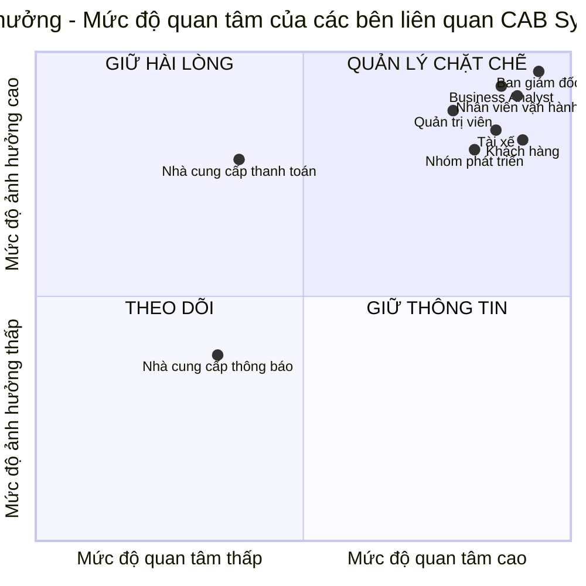
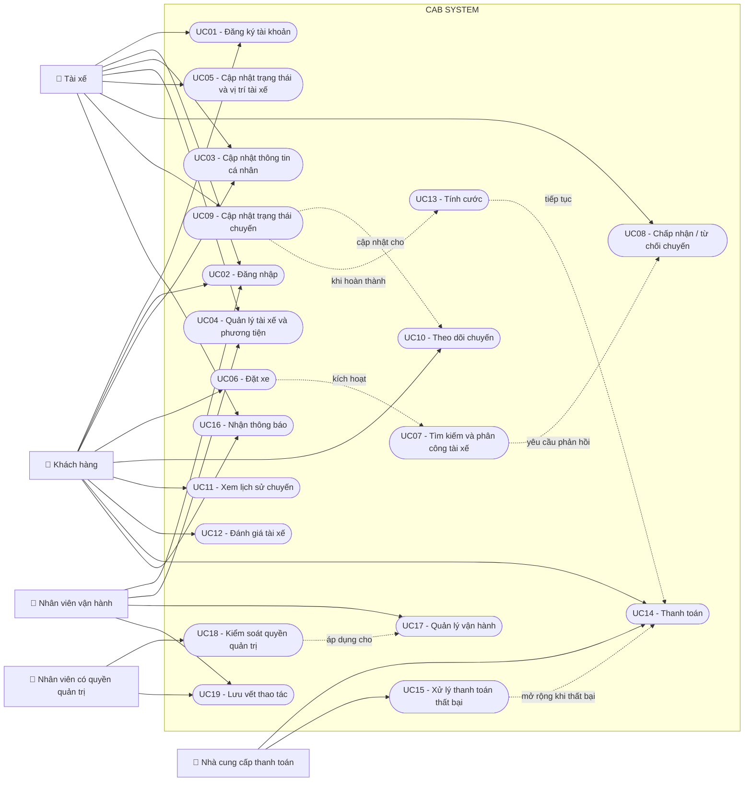

BG-01: Xây dựng nền tảng đặt xe CAB hoàn chỉnh và thống nhất quy trình đặt xe.

BG-02: Nâng cao hiệu quả tìm kiếm và phân công tài xế, giảm phụ thuộc vào xử lý thủ công.

BG-03: Nâng cao trải nghiệm khách hàng thông qua khả năng theo dõi đầy đủ trạng thái chuyến đi.

BG-04: Nâng cao hiệu quả làm việc và quản lý hoạt động của tài xế.

BG-05: Quản lý tập trung việc tính cước và thanh toán của các chuyến đi.

BG-06: Đảm bảo việc trao đổi và thông báo thông tin kịp thời giữa hệ thống, khách hàng và tài xế.

BG-07: Nâng cao hiệu quả quản lý và vận hành khách hàng, tài xế, phương tiện và chuyến đi.

BG-08: Cung cấp dữ liệu và báo cáo hỗ trợ ban lãnh đạo theo dõi và ra quyết định.

BG-09: Đảm bảo CAB System có khả năng hoạt động ổn định và mở rộng khi số lượng người dùng tăng.

BG-10: Hạn chế sự cố tại một thành phần làm ảnh hưởng đến toàn bộ hệ thống.

BG-11: Đảm bảo bảo mật, phân quyền và an toàn đối với dữ liệu của hệ thống.

BG-12: Xây dựng kiến trúc linh hoạt, hỗ trợ mở rộng dịch vụ và tích hợp mới trong tương lai.

BG-13: Hoàn thành xây dựng và triển khai hệ thống theo phạm vi được thống nhất trong vòng 7 tuần.
## Phạm vi và mức độ ưu tiên các module

Dựa trên yêu cầu của khách hàng và thời gian triển khai dự án trong **7 tuần**, CAB System tập trung phát triển các module trực tiếp phục vụ quy trình đặt xe, tìm tài xế, thực hiện chuyến, thanh toán và vận hành hệ thống. :contentReference[oaicite:0]{index=0}

### Danh sách module ưu tiên

| Mã | Module | Mức ưu tiên | BG liên quan | Phạm vi chính |
|---|---|---|---|---|
| **MD-01** | Quản lý tài khoản và xác thực | Cao | BG-01, BG-04, BG-07, BG-11 | Đăng ký, đăng nhập, cập nhật thông tin cá nhân, xác thực và phân quyền người dùng |
| **MD-02** | Quản lý tài xế và phương tiện | Cao | BG-02, BG-04, BG-07 | Quản lý hồ sơ tài xế, phương tiện, trạng thái hoạt động, trạng thái sẵn sàng và vị trí tài xế |
| **MD-03** | Đặt xe và quản lý chuyến đi | Rất cao | BG-01, BG-03 | Tạo yêu cầu đặt xe, chọn loại xe, theo dõi trạng thái chuyến, lịch sử chuyến và đánh giá tài xế |
| **MD-04** | Tìm kiếm và phân công tài xế | Rất cao | BG-02, BG-03, BG-04 | Tìm tài xế phù hợp, gửi yêu cầu chuyến, xử lý chấp nhận, từ chối hoặc không phản hồi |
| **MD-05** | Tính cước và thanh toán | Cao | BG-05, BG-10 | Tính cước sau chuyến, thanh toán tiền mặt, thanh toán điện tử và xử lý giao dịch thất bại |
| **MD-06** | Thông báo | Cao | BG-03, BG-04, BG-06, BG-10 | Gửi thông báo về đặt xe, tài xế nhận chuyến, trạng thái chuyến và kết quả thanh toán |
| **MD-07** | Quản lý vận hành và quản trị | Cao | BG-07, BG-11 | Quản lý khách hàng, tài xế, phương tiện, chuyến đi, giao dịch và quyền quản trị |
| **MD-08** | Báo cáo và giám sát hoạt động | Trung bình | BG-08 | Báo cáo số chuyến, doanh thu, tỷ lệ hoàn thành, tỷ lệ hủy và hiệu quả tài xế |

### Nhóm ưu tiên phát triển

#### Nhóm 1 – Chức năng cốt lõi

Các module bắt buộc ưu tiên phát triển trước:

- **MD-01:** Quản lý tài khoản và xác thực
- **MD-02:** Quản lý tài xế và phương tiện
- **MD-03:** Đặt xe và quản lý chuyến đi
- **MD-04:** Tìm kiếm và phân công tài xế
- **MD-05:** Tính cước và thanh toán
- **MD-06:** Thông báo

Các module này tạo thành luồng nghiệp vụ chính:

`Đăng nhập → Đặt xe → Tìm tài xế → Thực hiện chuyến → Hoàn thành chuyến → Tính cước → Thanh toán → Thông báo`

#### Nhóm 2 – Hỗ trợ vận hành

- **MD-07:** Quản lý vận hành và quản trị

Module này hỗ trợ nhân viên vận hành theo dõi và xử lý các hoạt động của CAB System.

#### Nhóm 3 – Hoàn thiện sau chức năng cốt lõi

- **MD-08:** Báo cáo và giám sát hoạt động

Module báo cáo được triển khai sau khi các chức năng đặt xe và vận hành chính hoạt động ổn định.

### Giới hạn phạm vi

Trong giai đoạn 7 tuần, dự án không mở rộng các chức năng ngoài yêu cầu khách hàng như:

- Khuyến mãi và voucher
- Điểm thưởng khách hàng
- Chat giữa khách hàng và tài xế
- Ví điện tử nội bộ
- Đặt xe trước
- Quản lý lương tài xế
- AI dự báo nhu cầu
- Dynamic Pricing
- Marketing

Các chức năng này có thể được xem xét trong các phiên bản sau nếu doanh nghiệp có yêu cầu.

### Các yêu cầu xuyên suốt hệ thống

Các mục tiêu **BG-09, BG-10, BG-11 và BG-12** không được xây dựng thành module riêng mà được áp dụng xuyên suốt toàn hệ thống, bao gồm:

- Khả năng mở rộng
- Khả năng chịu lỗi
- Bảo mật và phân quyền
- Bảo vệ dữ liệu
- Khả năng mở rộng và thay đổi kiến trúc trong tương lai

**BG-13** là ràng buộc tiến độ, yêu cầu hệ thống được xây dựng và triển khai trong vòng **7 tuần**.
## 5. Business Requirements

Các yêu cầu nghiệp vụ của CAB System được xác định dựa trên mục tiêu kinh doanh,quy trình đặt xe và các yêu cầu vận hành do khách hàng cung cấp.

## 5. Business Requirements

| Mã BR | Yêu cầu nghiệp vụ | Mô tả |
|---|---|---|
| **BR01** | Quản lý tài khoản người dùng | Hệ thống phải hỗ trợ đăng ký, đăng nhập và cập nhật thông tin cá nhân cho khách hàng và tài xế. Tài xế có thể tự đăng ký hoặc được nhân viên vận hành tạo tài khoản. |
| **BR02** | Quản lý tài xế và phương tiện | Hệ thống phải quản lý hồ sơ tài xế, thông tin phương tiện, trạng thái hoạt động và trạng thái sẵn sàng nhận chuyến. |
| **BR03** | Quản lý vị trí tài xế | Hệ thống phải lưu thông tin vị trí tài xế để hỗ trợ tìm tài xế gần khách hàng và dự kiến thời gian tài xế đến. |
| **BR04** | Tiếp nhận yêu cầu đặt xe | Khách hàng phải có thể nhập điểm đón, điểm đến, chọn loại xe và gửi yêu cầu đặt xe. |
| **BR05** | Tìm kiếm và phân công tài xế | Hệ thống phải tìm tài xế phù hợp dựa trên vị trí, trạng thái sẵn sàng và các tiêu chí vận hành khác. Nếu tài xế được đề xuất từ chối hoặc không phản hồi, hệ thống phải tiếp tục tìm tài xế khác mà không yêu cầu khách hàng tạo lại yêu cầu. Nếu không tìm được tài xế, hệ thống phải thông báo cho khách hàng. |
| **BR06** | Quản lý trạng thái chuyến đi | Tài xế phải có thể cập nhật các trạng thái: đã đến điểm đón, đã đón khách, đang di chuyển và hoàn thành chuyến. |
| **BR07** | Theo dõi chuyến đi | Khách hàng phải có thể theo dõi trạng thái tìm tài xế, tài xế đã nhận chuyến, thời gian dự kiến tài xế đến và trạng thái hiện tại của chuyến đi. |
| **BR08** | Quản lý lịch sử và đánh giá | Khách hàng phải có thể xem lịch sử chuyến đi, số tiền phải trả và đánh giá tài xế sau khi chuyến hoàn thành. |
| **BR09** | Tính cước chuyến đi | Sau khi chuyến hoàn thành, hệ thống phải xác định số tiền khách hàng phải trả dựa trên loại dịch vụ và thông tin chuyến đi. |
| **BR10** | Quản lý thanh toán | Hệ thống phải hỗ trợ thanh toán bằng tiền mặt và thanh toán điện tử thông qua nhà cung cấp thanh toán bên ngoài. CAB System không được lưu trực tiếp thông tin nhạy cảm của thẻ hoặc tài khoản thanh toán. |
| **BR11** | Xử lý thanh toán thất bại | Khi thanh toán điện tử thất bại, hệ thống phải thông báo cho khách hàng và cho phép xử lý lại theo chính sách của doanh nghiệp. |
| **BR12** | Quản lý thông báo | Hệ thống phải thông báo cho khách hàng khi yêu cầu đặt xe được tiếp nhận, có tài xế nhận chuyến, tài xế đến điểm đón, chuyến hoàn thành và thanh toán có kết quả. Tài xế phải nhận thông báo về chuyến mới và các thay đổi liên quan đến chuyến đang thực hiện. |
| **BR13** | Quản lý vận hành | Nhân viên vận hành phải có thể quản lý khách hàng, tài xế, phương tiện và chuyến đi; xem chuyến đang diễn ra, kiểm tra trạng thái tài xế, hỗ trợ xử lý chuyến lỗi và tra cứu lịch sử giao dịch. |
| **BR14** | Phân quyền quản trị | Các thao tác quản trị phải được kiểm soát quyền truy cập để nhân viên thông thường không thể thực hiện các thao tác nhạy cảm. |
| **BR15** | Bảo vệ và lưu vết dữ liệu | Thông tin cá nhân, phương tiện, vị trí và giao dịch phải được bảo vệ. Các thao tác quan trọng phải được lưu vết để phục vụ kiểm tra khi có sự cố. |

---
## 6. Mô tả chi tiết từng Quy trình nghiệp vụ

### BR01 – Quản lý tài khoản người dùng

**Mục tiêu:**  
Đảm bảo khách hàng và tài xế có tài khoản để sử dụng các chức năng của CAB System và được xác thực trước khi truy cập các chức năng yêu cầu đăng nhập.

**Tác nhân liên quan:**  
Khách hàng, Tài xế, Nhân viên vận hành.

**Mô tả chi tiết:**  
Hệ thống phải cho phép khách hàng đăng ký tài khoản, đăng nhập và cập nhật thông tin cá nhân. Đối với tài xế, tài khoản có thể được tạo theo hai cách: tài xế tự đăng ký hoặc nhân viên vận hành tạo tài khoản cho tài xế. Sau khi có tài khoản, tài xế có thể cập nhật hồ sơ cá nhân của mình.

Khách hàng và tài xế phải được xác thực trước khi sử dụng những chức năng yêu cầu tài khoản.

**Kết quả mong đợi:**  
- Khách hàng và tài xế có tài khoản trong CAB System.
- Người dùng có thể đăng nhập và cập nhật thông tin cá nhân.
- Người dùng được xác thực trước khi sử dụng các chức năng được bảo vệ.

---

### BR02 – Quản lý tài xế và phương tiện

**Mục tiêu:**  
Quản lý đầy đủ thông tin cần thiết của tài xế và phương tiện để phục vụ hoạt động vận hành và phân công chuyến.

**Tác nhân liên quan:**  
Tài xế, Nhân viên vận hành.

**Mô tả chi tiết:**  
Hệ thống phải lưu và quản lý hồ sơ tài xế, thông tin phương tiện và trạng thái hoạt động của tài xế. Tài xế có thể cập nhật hồ sơ và thông tin phương tiện của mình.

Khi đang làm việc và có khả năng nhận chuyến, tài xế có thể chuyển trạng thái sang **sẵn sàng nhận chuyến**. Trạng thái này được hệ thống sử dụng trong quá trình tìm kiếm tài xế phù hợp cho khách hàng.

Nhân viên vận hành phải có khả năng quản lý thông tin tài xế và phương tiện trong hệ thống.

**Kết quả mong đợi:**  
- Hồ sơ tài xế được lưu trữ.
- Thông tin phương tiện được quản lý.
- Trạng thái hoạt động của tài xế được cập nhật.
- Hệ thống xác định được tài xế nào đang sẵn sàng nhận chuyến.

---

### BR03 – Quản lý vị trí tài xế

**Mục tiêu:**  
Cung cấp dữ liệu vị trí phục vụ việc tìm tài xế gần khách hàng và hỗ trợ dự kiến thời gian tài xế đến điểm đón.

**Tác nhân liên quan:**  
Tài xế, Hệ thống CAB.

**Mô tả chi tiết:**  
Hệ thống phải có khả năng lưu thông tin vị trí của tài xế. Dữ liệu vị trí được sử dụng cùng với trạng thái sẵn sàng của tài xế để hỗ trợ xác định tài xế phù hợp với một yêu cầu đặt xe.

Thông tin vị trí cũng được sử dụng để cải thiện khả năng dự kiến thời gian tài xế đến điểm đón của khách hàng.

**Kết quả mong đợi:**  
- Hệ thống có thông tin vị trí của tài xế.
- Có thể xác định tài xế gần khách hàng.
- Có dữ liệu phục vụ việc dự kiến thời gian tài xế đến.

**Điểm chưa xác định:**  
Cách thức và tần suất cập nhật vị trí tài xế chưa được khách hàng mô tả cụ thể.

---

### BR04 – Tiếp nhận yêu cầu đặt xe

**Mục tiêu:**  
Cho phép khách hàng tạo yêu cầu đặt xe và bắt đầu quy trình tìm tài xế.

**Tác nhân liên quan:**  
Khách hàng, Hệ thống CAB.

**Mô tả chi tiết:**  
Khách hàng phải có khả năng nhập điểm đón, điểm đến và lựa chọn loại xe phù hợp. Sau khi hoàn tất thông tin cần thiết, khách hàng gửi yêu cầu đặt xe đến CAB System.

Hệ thống tiếp nhận yêu cầu và bắt đầu quá trình tìm kiếm tài xế. Khách hàng phải được thông báo rằng yêu cầu đặt xe đã được hệ thống tiếp nhận.

**Thông tin chính của yêu cầu đặt xe:**  
- Điểm đón.
- Điểm đến.
- Loại xe.
- Khách hàng tạo yêu cầu.

**Kết quả mong đợi:**  
Một yêu cầu đặt xe được tạo và chuyển sang quá trình tìm kiếm, phân công tài xế.

---

### BR05 – Tìm kiếm và phân công tài xế

**Mục tiêu:**  
Giảm việc phân công tài xế thủ công và tự động xác định tài xế phù hợp cho yêu cầu đặt xe.

**Tác nhân liên quan:**  
Khách hàng, Tài xế, Hệ thống CAB.

**Mô tả chi tiết:**  
Khi khách hàng tạo yêu cầu đặt xe, hệ thống phải xác định các tài xế phù hợp dựa trên vị trí, trạng thái sẵn sàng và các tiêu chí vận hành khác.

Hệ thống cần ưu tiên tài xế phù hợp và gần khách hàng. Khi một tài xế được đề xuất, tài xế phải nhận được thông báo về chuyến mới và có thể chấp nhận hoặc từ chối chuyến.

Nếu tài xế đầu tiên từ chối hoặc không phản hồi, hệ thống phải tiếp tục tìm tài xế khác mà không yêu cầu khách hàng tạo lại yêu cầu đặt xe.

Nếu không tìm được tài xế phù hợp, hệ thống phải thông báo rõ ràng cho khách hàng.

**Kết quả mong đợi:**  
- Tìm được tài xế và phân công chuyến; hoặc
- Tiếp tục tìm tài xế khác khi tài xế từ chối/không phản hồi; hoặc
- Thông báo cho khách hàng khi không tìm được tài xế.

**Điểm chưa xác định:**  
- Tiêu chí ưu tiên tài xế cụ thể.
- Thời gian tài xế phải phản hồi yêu cầu chuyến.

---

### BR06 – Quản lý trạng thái chuyến đi

**Mục tiêu:**  
Theo dõi tiến trình thực hiện chuyến từ khi tài xế đến đón khách cho đến khi hoàn thành.

**Tác nhân liên quan:**  
Tài xế, Hệ thống CAB.

**Mô tả chi tiết:**  
Sau khi tài xế nhận chuyến, tài xế phải có khả năng cập nhật trạng thái chuyến trong quá trình thực hiện.

Các trạng thái được khách hàng yêu cầu gồm:

- **Đã đến điểm đón**
- **Đã đón khách**
- **Đang di chuyển**
- **Hoàn thành chuyến**

Mỗi lần tài xế thay đổi trạng thái, hệ thống phải ghi nhận trạng thái hiện tại của chuyến để khách hàng và bộ phận vận hành có thể theo dõi.

**Kết quả mong đợi:**  
Hệ thống luôn xác định được trạng thái hiện tại của một chuyến đang được thực hiện.

---

### BR07 – Theo dõi chuyến đi

**Mục tiêu:**  
Giúp khách hàng biết được tình trạng yêu cầu đặt xe và trạng thái chuyến đi thay vì phải chờ mà không có thông tin.

**Tác nhân liên quan:**  
Khách hàng, Hệ thống CAB, Tài xế.

**Mô tả chi tiết:**  
Sau khi khách hàng gửi yêu cầu đặt xe, khách hàng phải có khả năng theo dõi quá trình xử lý yêu cầu.

Khách hàng cần biết:

- Hệ thống có đang tìm tài xế hay không.
- Tài xế nào đã nhận chuyến.
- Thời gian dự kiến tài xế đến.
- Trạng thái hiện tại của chuyến.

Các thay đổi trạng thái do tài xế cập nhật phải được phản ánh để khách hàng có thể theo dõi tiến trình chuyến đi.

**Kết quả mong đợi:**  
Khách hàng có thể theo dõi trạng thái của chuyến từ khi yêu cầu được tạo cho đến khi chuyến hoàn thành.

---

### BR08 – Quản lý lịch sử và đánh giá

**Mục tiêu:**  
Cho phép khách hàng tra cứu thông tin các chuyến đã thực hiện và đánh giá tài xế sau chuyến.

**Tác nhân liên quan:**  
Khách hàng.

**Mô tả chi tiết:**  
Hệ thống phải lưu thông tin chuyến để khách hàng có thể xem lại lịch sử chuyến đi.

Khách hàng phải có khả năng xem thông tin về chuyến và số tiền phải trả. Sau khi chuyến đi hoàn thành, khách hàng có thể thực hiện đánh giá tài xế.

**Kết quả mong đợi:**  
- Khách hàng xem được lịch sử chuyến đi.
- Khách hàng xem được số tiền của chuyến.
- Khách hàng có thể đánh giá tài xế sau chuyến hoàn thành.

---

### BR09 – Tính cước chuyến đi

**Mục tiêu:**  
Xác định số tiền khách hàng phải thanh toán sau khi chuyến đi hoàn thành.

**Tác nhân liên quan:**  
Hệ thống CAB.

**Mô tả chi tiết:**  
Sau khi chuyến đi được xác định là hoàn thành, hệ thống phải tính số tiền khách hàng phải trả.

Số tiền được xác định dựa trên:

- Loại dịch vụ.
- Thông tin của chuyến đi.
- Quy tắc tính cước của doanh nghiệp.

Kết quả tính cước phải được sử dụng cho bước thanh toán và có thể được khách hàng xem trong thông tin chuyến.

**Kết quả mong đợi:**  
Mỗi chuyến hoàn thành có số tiền phải thanh toán được xác định.

**Điểm chưa xác định:**  
Cách tính cước cụ thể hiện chưa được doanh nghiệp chốt và cần được BA làm rõ.

---

### BR10 – Quản lý thanh toán

**Mục tiêu:**  
Quản lý tập trung việc thanh toán cho các chuyến đi.

**Tác nhân liên quan:**  
Khách hàng, Hệ thống CAB, Nhà cung cấp thanh toán bên ngoài.

**Mô tả chi tiết:**  
Sau khi số tiền chuyến đi được xác định, khách hàng có thể thực hiện thanh toán.

CAB System phải hỗ trợ:

- Thanh toán bằng tiền mặt.
- Thanh toán bằng phương thức điện tử.

Đối với thanh toán điện tử, CAB System phải tích hợp với một nhà cung cấp thanh toán bên ngoài để xử lý giao dịch.

CAB System không được lưu trực tiếp thông tin nhạy cảm của thẻ hoặc tài khoản thanh toán của khách hàng.

Hệ thống phải ghi nhận kết quả thanh toán để phục vụ việc quản lý và tra cứu giao dịch.

**Kết quả mong đợi:**  
Thanh toán của chuyến được xử lý và kết quả giao dịch được ghi nhận.

---

### BR11 – Xử lý thanh toán thất bại

**Mục tiêu:**  
Đảm bảo khách hàng được thông báo và có phương án xử lý khi giao dịch thanh toán điện tử không thành công.

**Tác nhân liên quan:**  
Khách hàng, Hệ thống CAB, Nhà cung cấp thanh toán bên ngoài.

**Mô tả chi tiết:**  
Khi CAB System nhận kết quả thanh toán điện tử thất bại từ nhà cung cấp thanh toán, hệ thống phải ghi nhận kết quả và thông báo cho khách hàng.

Khách hàng phải có khả năng xử lý lại giao dịch theo chính sách của doanh nghiệp.

Sự cố tại chức năng thanh toán không được làm toàn bộ hệ thống đặt xe ngừng hoạt động.

**Kết quả mong đợi:**  
- Khách hàng biết được giao dịch đã thất bại.
- Kết quả thất bại được ghi nhận.
- Giao dịch có thể được xử lý lại theo chính sách của doanh nghiệp.

**Điểm chưa xác định:**  
Chính sách cụ thể về cách xử lý lại giao dịch chưa được mô tả trong tài liệu.

---

### BR12 – Quản lý thông báo

**Mục tiêu:**  
Đảm bảo khách hàng và tài xế nhận được thông tin cần thiết trong suốt quá trình đặt và thực hiện chuyến.

**Tác nhân liên quan:**  
Khách hàng, Tài xế, Hệ thống CAB.

**Mô tả chi tiết:**  
Khách hàng phải nhận được thông báo khi:

- Yêu cầu đặt xe được tiếp nhận.
- Có tài xế nhận chuyến.
- Tài xế đến điểm đón.
- Chuyến đi hoàn thành.
- Thanh toán có kết quả.

Tài xế phải nhận được thông báo khi:

- Có chuyến mới.
- Có thay đổi liên quan đến chuyến đang thực hiện.

Hệ thống cần được thiết kế để trong tương lai có thể bổ sung thêm các kênh hoặc nhà cung cấp thông báo mà không phải thay đổi toàn bộ hệ thống.

Sự cố ở thành phần thông báo không được làm toàn bộ hệ thống đặt xe ngừng hoạt động.

**Kết quả mong đợi:**  
Thông tin quan trọng của chuyến được truyền đến khách hàng và tài xế đúng theo các sự kiện nghiệp vụ.

---

### BR13 – Quản lý vận hành

**Mục tiêu:**  
Cung cấp cho bộ phận vận hành công cụ để theo dõi và quản lý hoạt động của CAB System.

**Tác nhân liên quan:**  
Nhân viên vận hành.

**Mô tả chi tiết:**  
Hệ thống phải cung cấp giao diện quản trị cho nhân viên vận hành.

Nhân viên vận hành phải có khả năng:

- Quản lý khách hàng.
- Quản lý tài xế.
- Quản lý phương tiện.
- Quản lý chuyến đi.
- Xem các chuyến đang diễn ra.
- Kiểm tra trạng thái tài xế.
- Hỗ trợ xử lý các trường hợp chuyến bị lỗi.
- Tra cứu lịch sử giao dịch.

Các chức năng này giúp bộ phận vận hành theo dõi hoạt động và phối hợp xử lý các vấn đề phát sinh trong hệ thống.

**Kết quả mong đợi:**  
Nhân viên vận hành có đủ thông tin và chức năng cần thiết để theo dõi và hỗ trợ hoạt động của CAB System.

---

### BR14 – Phân quyền quản trị

**Mục tiêu:**  
Ngăn người dùng không có quyền thực hiện các thao tác quản trị nhạy cảm.

**Tác nhân liên quan:**  
Nhân viên vận hành, Hệ thống CAB.

**Mô tả chi tiết:**  
Các chức năng quản trị của CAB System phải được kiểm soát quyền truy cập.

Khi nhân viên thực hiện thao tác quản trị, hệ thống phải xác định người dùng có quyền phù hợp hay không.

Nhân viên thông thường không được phép thực hiện những thao tác nhạy cảm nếu không có quyền tương ứng.

**Kết quả mong đợi:**  
Chỉ người dùng có quyền phù hợp mới có thể thực hiện các thao tác quản trị nhạy cảm.

**Điểm chưa xác định:**  
Tài liệu chưa xác định cụ thể:
- Các cấp quyền quản trị.
- Danh sách thao tác được xem là nhạy cảm.
- Quyền cụ thể của từng nhóm nhân viên.

---

### BR15 – Bảo vệ và lưu vết dữ liệu

**Mục tiêu:**  
Bảo vệ các dữ liệu quan trọng của CAB System và hỗ trợ kiểm tra khi xảy ra sự cố.

**Tác nhân liên quan:**  
Hệ thống CAB và các người dùng có quyền truy cập dữ liệu.

**Mô tả chi tiết:**  
Hệ thống phải bảo vệ các nhóm dữ liệu được khách hàng xác định, bao gồm:

- Thông tin cá nhân.
- Thông tin phương tiện.
- Dữ liệu vị trí.
- Dữ liệu giao dịch.

Khách hàng và tài xế phải được xác thực trước khi sử dụng các chức năng yêu cầu tài khoản. Các thao tác quản trị phải được kiểm soát quyền truy cập.

Ngoài việc bảo vệ dữ liệu, CAB System phải lưu vết các thao tác quan trọng để doanh nghiệp có thể kiểm tra khi xảy ra sự cố.

**Kết quả mong đợi:**  
- Dữ liệu quan trọng được bảo vệ.
- Truy cập quản trị được kiểm soát.
- Các thao tác quan trọng có dữ liệu lưu vết phục vụ kiểm tra.

**Điểm chưa xác định:**  
Thời gian lưu trữ dữ liệu chưa được khách hàng chốt.
## 6. Thiết kế các chức năng nghiệp vụ

Các chức năng nghiệp vụ của CAB System được thiết kế dựa trên các Business Requirements BR01–BR15. Mỗi chức năng mô tả tác nhân tham gia, dữ liệu đầu vào, cách xử lý và kết quả nghiệp vụ.

---

## 6. Functional Requirements

Các yêu cầu chức năng của CAB System được xây dựng từ các Business Requirements BR01–BR15.

### FR01 – Quản lý tài khoản người dùng

**BR liên quan:** BR01  
**Tác nhân:** Khách hàng, Tài xế, Nhân viên vận hành

**Mô tả:**  
Hệ thống phải hỗ trợ quản lý tài khoản của khách hàng và tài xế.

**Yêu cầu chức năng:**

- **FR01.1:** Hệ thống phải cho phép khách hàng đăng ký tài khoản.
- **FR01.2:** Hệ thống phải cho phép tài xế đăng ký tài khoản.
- **FR01.3:** Hệ thống phải cho phép nhân viên vận hành tạo tài khoản cho tài xế.
- **FR01.4:** Hệ thống phải cho phép khách hàng và tài xế đăng nhập.
- **FR01.5:** Hệ thống phải xác thực khách hàng và tài xế trước khi sử dụng các chức năng yêu cầu tài khoản.
- **FR01.6:** Hệ thống phải cho phép khách hàng cập nhật thông tin cá nhân.
- **FR01.7:** Hệ thống phải cho phép tài xế cập nhật thông tin cá nhân.

---

### FR02 – Quản lý tài xế và phương tiện

**BR liên quan:** BR02  
**Tác nhân:** Tài xế, Nhân viên vận hành

**Mô tả:**  
Hệ thống phải quản lý thông tin tài xế, phương tiện và trạng thái hoạt động của tài xế.

**Yêu cầu chức năng:**

- **FR02.1:** Hệ thống phải cho phép tài xế cập nhật hồ sơ.
- **FR02.2:** Hệ thống phải cho phép tài xế cập nhật thông tin phương tiện.
- **FR02.3:** Hệ thống phải lưu thông tin hồ sơ tài xế.
- **FR02.4:** Hệ thống phải lưu thông tin phương tiện.
- **FR02.5:** Hệ thống phải cho phép tài xế cập nhật trạng thái hoạt động.
- **FR02.6:** Hệ thống phải cho phép tài xế chuyển sang trạng thái sẵn sàng nhận chuyến.
- **FR02.7:** Hệ thống phải cho phép nhân viên vận hành quản lý thông tin tài xế và phương tiện.

---

### FR03 – Quản lý vị trí tài xế

**BR liên quan:** BR03  
**Tác nhân:** Tài xế, Hệ thống CAB

**Mô tả:**  
Hệ thống phải quản lý vị trí tài xế để hỗ trợ tìm tài xế và dự kiến thời gian đến.

**Yêu cầu chức năng:**

- **FR03.1:** Hệ thống phải tiếp nhận thông tin vị trí của tài xế.
- **FR03.2:** Hệ thống phải lưu và cập nhật vị trí tài xế.
- **FR03.3:** Hệ thống phải sử dụng vị trí tài xế để hỗ trợ xác định tài xế gần khách hàng.
- **FR03.4:** Hệ thống phải sử dụng dữ liệu vị trí để hỗ trợ dự kiến thời gian tài xế đến điểm đón.

**TBD:** Tần suất và cách thức cập nhật vị trí tài xế chưa được xác định.

---

### FR04 – Tiếp nhận yêu cầu đặt xe

**BR liên quan:** BR04  
**Tác nhân:** Khách hàng

**Mô tả:**  
Hệ thống phải cho phép khách hàng tạo yêu cầu đặt xe.

**Yêu cầu chức năng:**

- **FR04.1:** Hệ thống phải cho phép khách hàng nhập điểm đón.
- **FR04.2:** Hệ thống phải cho phép khách hàng nhập điểm đến.
- **FR04.3:** Hệ thống phải cho phép khách hàng lựa chọn loại xe.
- **FR04.4:** Hệ thống phải cho phép khách hàng gửi yêu cầu đặt xe.
- **FR04.5:** Hệ thống phải tiếp nhận và ghi nhận yêu cầu đặt xe.
- **FR04.6:** Hệ thống phải bắt đầu quá trình tìm tài xế sau khi tiếp nhận yêu cầu.
- **FR04.7:** Hệ thống phải thông báo cho khách hàng khi yêu cầu đặt xe đã được tiếp nhận.

---

### FR05 – Tìm kiếm và phân công tài xế

**BR liên quan:** BR05  
**Tác nhân:** Hệ thống CAB, Tài xế, Khách hàng

**Mô tả:**  
Hệ thống phải tìm và phân công tài xế phù hợp cho yêu cầu đặt xe.

**Yêu cầu chức năng:**

- **FR05.1:** Hệ thống phải xác định các tài xế đang ở trạng thái sẵn sàng nhận chuyến.
- **FR05.2:** Hệ thống phải xem xét vị trí tài xế khi tìm kiếm tài xế phù hợp.
- **FR05.3:** Hệ thống phải xác định tài xế dựa trên vị trí, trạng thái sẵn sàng và các tiêu chí vận hành khác.
- **FR05.4:** Hệ thống phải ưu tiên tài xế phù hợp và gần khách hàng.
- **FR05.5:** Hệ thống phải gửi yêu cầu chuyến cho tài xế được đề xuất.
- **FR05.6:** Hệ thống phải cho phép tài xế chấp nhận chuyến.
- **FR05.7:** Hệ thống phải cho phép tài xế từ chối chuyến.
- **FR05.8:** Khi tài xế chấp nhận, hệ thống phải phân công chuyến cho tài xế đó.
- **FR05.9:** Nếu tài xế từ chối hoặc không phản hồi, hệ thống phải tiếp tục tìm tài xế khác.
- **FR05.10:** Hệ thống không được yêu cầu khách hàng tạo lại yêu cầu khi tài xế từ chối hoặc không phản hồi.
- **FR05.11:** Nếu không tìm được tài xế, hệ thống phải thông báo rõ ràng cho khách hàng.

**TBD:**

- Tiêu chí ưu tiên tài xế cụ thể.
- Thời gian tối đa tài xế phải phản hồi.

---

### FR06 – Quản lý trạng thái chuyến đi

**BR liên quan:** BR06  
**Tác nhân:** Tài xế

**Mô tả:**  
Hệ thống phải cho phép tài xế cập nhật trạng thái trong quá trình thực hiện chuyến.

**Yêu cầu chức năng:**

- **FR06.1:** Hệ thống phải cho phép tài xế cập nhật trạng thái `Đã đến điểm đón`.
- **FR06.2:** Hệ thống phải cho phép tài xế cập nhật trạng thái `Đã đón khách`.
- **FR06.3:** Hệ thống phải cho phép tài xế cập nhật trạng thái `Đang di chuyển`.
- **FR06.4:** Hệ thống phải cho phép tài xế cập nhật trạng thái `Hoàn thành chuyến`.
- **FR06.5:** Hệ thống phải lưu trạng thái hiện tại của chuyến đi.

---

### FR07 – Theo dõi chuyến đi

**BR liên quan:** BR07  
**Tác nhân:** Khách hàng

**Mô tả:**  
Hệ thống phải cho phép khách hàng theo dõi trạng thái của yêu cầu đặt xe và chuyến đi.

**Yêu cầu chức năng:**

- **FR07.1:** Hệ thống phải hiển thị trạng thái đang tìm tài xế.
- **FR07.2:** Hệ thống phải cho khách hàng biết tài xế nào đã nhận chuyến.
- **FR07.3:** Hệ thống phải cung cấp thời gian dự kiến tài xế đến.
- **FR07.4:** Hệ thống phải hiển thị trạng thái hiện tại của chuyến đi.
- **FR07.5:** Trạng thái chuyến phải được cập nhật cho khách hàng khi tài xế thay đổi trạng thái.

---

### FR08 – Quản lý lịch sử chuyến đi và đánh giá

**BR liên quan:** BR08  
**Tác nhân:** Khách hàng

**Mô tả:**  
Hệ thống phải cho phép khách hàng xem lại các chuyến đi và đánh giá tài xế sau chuyến.

**Yêu cầu chức năng:**

- **FR08.1:** Hệ thống phải lưu lịch sử chuyến đi của khách hàng.
- **FR08.2:** Hệ thống phải cho phép khách hàng xem lịch sử chuyến đi.
- **FR08.3:** Hệ thống phải cho phép khách hàng xem thông tin của từng chuyến.
- **FR08.4:** Hệ thống phải hiển thị số tiền phải trả của chuyến.
- **FR08.5:** Hệ thống phải cho phép khách hàng đánh giá tài xế sau khi chuyến hoàn thành.
- **FR08.6:** Hệ thống phải lưu kết quả đánh giá của khách hàng.

---

### FR09 – Tính cước chuyến đi

**BR liên quan:** BR09  
**Tác nhân:** Hệ thống CAB

**Mô tả:**  
Hệ thống phải xác định số tiền khách hàng phải trả sau khi chuyến đi hoàn thành.

**Yêu cầu chức năng:**

- **FR09.1:** Hệ thống phải thực hiện tính cước sau khi chuyến đi hoàn thành.
- **FR09.2:** Hệ thống phải xác định loại dịch vụ của chuyến.
- **FR09.3:** Hệ thống phải sử dụng thông tin chuyến đi để tính cước.
- **FR09.4:** Hệ thống phải áp dụng quy tắc tính cước của doanh nghiệp.
- **FR09.5:** Hệ thống phải ghi nhận số tiền khách hàng phải trả.

**TBD:** Công thức và quy tắc tính cước cụ thể chưa được khách hàng xác định.

---

### FR10 – Quản lý thanh toán

**BR liên quan:** BR10  
**Tác nhân:** Khách hàng, Hệ thống CAB, Nhà cung cấp thanh toán bên ngoài

**Mô tả:**  
Hệ thống phải hỗ trợ thanh toán cho chuyến đi bằng tiền mặt hoặc phương thức điện tử.

**Yêu cầu chức năng:**

- **FR10.1:** Hệ thống phải hỗ trợ hình thức thanh toán bằng tiền mặt.
- **FR10.2:** Hệ thống phải hỗ trợ hình thức thanh toán điện tử.
- **FR10.3:** Hệ thống phải tích hợp với nhà cung cấp thanh toán bên ngoài để xử lý thanh toán điện tử.
- **FR10.4:** Hệ thống phải gửi yêu cầu thanh toán điện tử đến nhà cung cấp thanh toán.
- **FR10.5:** Hệ thống phải tiếp nhận kết quả giao dịch từ nhà cung cấp thanh toán.
- **FR10.6:** Hệ thống phải ghi nhận kết quả thanh toán.
- **FR10.7:** Hệ thống phải thông báo kết quả thanh toán cho khách hàng.
- **FR10.8:** CAB System không được lưu trực tiếp thông tin nhạy cảm của thẻ hoặc tài khoản thanh toán.

---

### FR11 – Xử lý thanh toán thất bại

**BR liên quan:** BR11  
**Tác nhân:** Khách hàng, Hệ thống CAB, Nhà cung cấp thanh toán

**Mô tả:**  
Hệ thống phải xử lý trường hợp giao dịch thanh toán điện tử không thành công.

**Yêu cầu chức năng:**

- **FR11.1:** Hệ thống phải tiếp nhận kết quả giao dịch thất bại từ nhà cung cấp thanh toán.
- **FR11.2:** Hệ thống phải ghi nhận trạng thái thanh toán thất bại.
- **FR11.3:** Hệ thống phải thông báo cho khách hàng khi thanh toán thất bại.
- **FR11.4:** Hệ thống phải cho phép xử lý lại giao dịch theo chính sách của doanh nghiệp.

**TBD:** Chính sách xử lý lại giao dịch chưa được xác định cụ thể.

---

### FR12 – Quản lý thông báo

**BR liên quan:** BR12  
**Tác nhân:** Khách hàng, Tài xế

**Mô tả:**  
Hệ thống phải gửi thông báo cho khách hàng và tài xế khi xảy ra các sự kiện liên quan đến chuyến đi và thanh toán.

**Yêu cầu chức năng:**

- **FR12.1:** Hệ thống phải thông báo cho khách hàng khi yêu cầu đặt xe được tiếp nhận.
- **FR12.2:** Hệ thống phải thông báo cho khách hàng khi có tài xế nhận chuyến.
- **FR12.3:** Hệ thống phải thông báo cho khách hàng khi tài xế đến điểm đón.
- **FR12.4:** Hệ thống phải thông báo cho khách hàng khi chuyến hoàn thành.
- **FR12.5:** Hệ thống phải thông báo cho khách hàng khi thanh toán có kết quả.
- **FR12.6:** Hệ thống phải thông báo cho tài xế khi có chuyến mới.
- **FR12.7:** Hệ thống phải thông báo cho tài xế về các thay đổi liên quan đến chuyến đang thực hiện.

---

### FR13 – Quản lý vận hành

**BR liên quan:** BR13  
**Tác nhân:** Nhân viên vận hành

**Mô tả:**  
Hệ thống phải cung cấp giao diện và chức năng phục vụ quản lý hoạt động của CAB System.

**Yêu cầu chức năng:**

- **FR13.1:** Hệ thống phải cho phép nhân viên vận hành quản lý khách hàng.
- **FR13.2:** Hệ thống phải cho phép nhân viên vận hành quản lý tài xế.
- **FR13.3:** Hệ thống phải cho phép nhân viên vận hành quản lý phương tiện.
- **FR13.4:** Hệ thống phải cho phép nhân viên vận hành quản lý chuyến đi.
- **FR13.5:** Hệ thống phải cho phép xem các chuyến đang diễn ra.
- **FR13.6:** Hệ thống phải cho phép kiểm tra trạng thái tài xế.
- **FR13.7:** Hệ thống phải hỗ trợ nhân viên vận hành xử lý các trường hợp chuyến gặp lỗi.
- **FR13.8:** Hệ thống phải cho phép tra cứu lịch sử giao dịch.

---

### FR14 – Phân quyền quản trị

**BR liên quan:** BR14  
**Tác nhân:** Nhân viên vận hành, Hệ thống CAB

**Mô tả:**  
Hệ thống phải kiểm soát quyền truy cập đối với các chức năng quản trị.

**Yêu cầu chức năng:**

- **FR14.1:** Hệ thống phải kiểm tra quyền của người dùng khi thực hiện thao tác quản trị.
- **FR14.2:** Hệ thống chỉ cho phép thực hiện thao tác khi người dùng có quyền phù hợp.
- **FR14.3:** Hệ thống phải từ chối thao tác nhạy cảm khi người dùng không có quyền.
- **FR14.4:** Hệ thống phải lưu vết các thao tác quản trị quan trọng.

**TBD:**

- Các cấp quyền quản trị.
- Danh sách thao tác nhạy cảm.
- Quyền cụ thể của từng nhóm nhân viên.

---

### FR15 – Bảo vệ và lưu vết dữ liệu

**BR liên quan:** BR15  
**Tác nhân:** Hệ thống CAB, Người dùng có quyền truy cập

**Mô tả:**  
Hệ thống phải bảo vệ dữ liệu quan trọng và lưu vết các thao tác quan trọng phục vụ kiểm tra khi xảy ra sự cố.

**Yêu cầu chức năng:**

- **FR15.1:** Hệ thống phải bảo vệ thông tin cá nhân.
- **FR15.2:** Hệ thống phải bảo vệ thông tin phương tiện.
- **FR15.3:** Hệ thống phải bảo vệ dữ liệu vị trí.
- **FR15.4:** Hệ thống phải bảo vệ dữ liệu giao dịch.
- **FR15.5:** Hệ thống phải kiểm soát truy cập đối với dữ liệu và chức năng yêu cầu quyền.
- **FR15.6:** Hệ thống phải lưu vết các thao tác quan trọng.
- **FR15.7:** Hệ thống phải cho phép sử dụng dữ liệu lưu vết để phục vụ kiểm tra khi xảy ra sự cố.

**TBD:** Thời gian lưu trữ dữ liệu chưa được khách hàng xác định.
## 8. Quy định nghiệp vụ và các ngoại lệ

### 8.1. Quy định nghiệp vụ

| Mã | Quy định nghiệp vụ | BR/FR liên quan |
|---|---|---|
| **BRU-01** | Khách hàng và tài xế phải được xác thực trước khi sử dụng các chức năng yêu cầu tài khoản. | BR01 / FR01 |
| **BRU-02** | Tài khoản tài xế có thể do tài xế tự đăng ký hoặc do nhân viên vận hành tạo. | BR01 / FR01 |
| **BRU-03** | Chỉ tài xế ở trạng thái **sẵn sàng nhận chuyến** mới được xem xét trong quá trình tìm kiếm và phân công chuyến. | BR02, BR05 / FR02, FR05 |
| **BRU-04** | Việc tìm tài xế phải dựa trên vị trí, trạng thái sẵn sàng và các tiêu chí vận hành khác. | BR03, BR05 / FR03, FR05 |
| **BRU-05** | Hệ thống phải ưu tiên tài xế phù hợp và gần khách hàng khi phân công chuyến. | BR05 / FR05 |
| **BRU-06** | Tài xế được quyền chấp nhận hoặc từ chối yêu cầu chuyến. | BR05 / FR05 |
| **BRU-07** | Nếu tài xế được đề xuất từ chối hoặc không phản hồi, hệ thống phải tiếp tục tìm tài xế khác mà không yêu cầu khách hàng tạo lại yêu cầu đặt xe. | BR05 / FR05 |
| **BRU-08** | Nếu không tìm được tài xế phù hợp, hệ thống phải thông báo rõ ràng cho khách hàng. | BR05 / FR05 |
| **BRU-09** | Trong quá trình thực hiện chuyến, tài xế phải có khả năng cập nhật các trạng thái: **Đã đến điểm đón → Đã đón khách → Đang di chuyển → Hoàn thành chuyến**. | BR06 / FR06 |
| **BRU-10** | Sau khi khách hàng gửi yêu cầu, hệ thống phải cho phép khách hàng theo dõi quá trình tìm tài xế, tài xế nhận chuyến, thời gian dự kiến tài xế đến và trạng thái hiện tại của chuyến. | BR07 / FR07 |
| **BRU-11** | Việc tính cước được thực hiện sau khi chuyến đi hoàn thành và dựa trên loại dịch vụ cùng thông tin chuyến đi. | BR09 / FR09 |
| **BRU-12** | Khách hàng có thể thanh toán bằng tiền mặt hoặc phương thức thanh toán điện tử. | BR10 / FR10 |
| **BRU-13** | Thanh toán điện tử phải được xử lý thông qua nhà cung cấp thanh toán bên ngoài. | BR10 / FR10 |
| **BRU-14** | CAB System không được lưu trực tiếp thông tin nhạy cảm của thẻ hoặc tài khoản thanh toán. | BR10 / FR10 |
| **BRU-15** | Khi giao dịch thanh toán điện tử thất bại, hệ thống phải thông báo cho khách hàng và cho phép xử lý lại theo chính sách của doanh nghiệp. | BR11 / FR11 |
| **BRU-16** | Khách hàng phải được thông báo khi yêu cầu đặt xe được tiếp nhận, có tài xế nhận chuyến, tài xế đến điểm đón, chuyến hoàn thành và thanh toán có kết quả. | BR12 / FR12 |
| **BRU-17** | Tài xế phải nhận được thông báo khi có chuyến mới hoặc khi có thay đổi liên quan đến chuyến đang thực hiện. | BR12 / FR12 |
| **BRU-18** | Một số thao tác quản trị phải được kiểm soát quyền truy cập; nhân viên thông thường không được thực hiện các thao tác nhạy cảm nếu không có quyền phù hợp. | BR14 / FR14 |
| **BRU-19** | Thông tin cá nhân, phương tiện, vị trí và giao dịch phải được bảo vệ. | BR15 / FR15 |
| **BRU-20** | Các thao tác quan trọng phải được lưu vết để phục vụ kiểm tra khi xảy ra sự cố. | BR15 / FR15 |
| **BRU-21** | Sự cố tại chức năng thanh toán hoặc thông báo không được làm toàn bộ hệ thống đặt xe ngừng hoạt động. | FR10, FR11, FR12 |

---

### 8.2. Các trường hợp ngoại lệ

| Mã | Ngoại lệ | Cách xử lý |
|---|---|---|
| **EX-01** | Tài xế từ chối chuyến | Hệ thống tiếp tục tìm kiếm và gửi yêu cầu đến tài xế phù hợp khác. Khách hàng không phải tạo lại yêu cầu đặt xe. |
| **EX-02** | Tài xế không phản hồi yêu cầu chuyến | Hệ thống phải tiếp tục tìm tài xế khác. Thời gian chờ phản hồi cụ thể hiện chưa được khách hàng xác định. |
| **EX-03** | Không tìm được tài xế phù hợp | Hệ thống phải thông báo rõ ràng cho khách hàng rằng hiện không tìm được tài xế. |
| **EX-04** | Thanh toán điện tử thất bại | Hệ thống ghi nhận kết quả thất bại, thông báo cho khách hàng và cho phép xử lý lại theo chính sách của doanh nghiệp. |
| **EX-05** | Dịch vụ thanh toán gặp sự cố | Sự cố thanh toán không được làm toàn bộ hệ thống đặt xe ngừng hoạt động. |
| **EX-06** | Thành phần thông báo gặp sự cố | Sự cố thông báo không được làm toàn bộ hệ thống đặt xe ngừng hoạt động. |
| **EX-07** | Khách hàng hoặc tài xế mất kết nối mạng | Cách xử lý chưa được khách hàng xác định và cần được BA làm rõ. |
| **EX-08** | Khách hàng hoặc tài xế hủy chuyến | Chính sách và cách xử lý hủy chuyến chưa được khách hàng xác định. |

---

### 8.3. Các quy định nghiệp vụ chưa được xác định

Các nội dung sau chưa được khách hàng chốt nên chưa thể xây dựng thành quy tắc nghiệp vụ cụ thể:

| Mã | Nội dung cần làm rõ | Trạng thái |
|---|---|---|
| **TBD-01** | Công thức và cách tính cước chuyến đi | Chưa xác định |
| **TBD-02** | Tiêu chí và thứ tự ưu tiên tài xế | Chưa xác định |
| **TBD-03** | Thời gian tối đa tài xế được phép phản hồi yêu cầu chuyến | Chưa xác định |
| **TBD-04** | Chính sách hủy chuyến | Chưa xác định |
| **TBD-05** | Cách xử lý khi mất kết nối mạng | Chưa xác định |
| **TBD-06** | Thời gian lưu trữ dữ liệu | Chưa xác định |
## 9. Non-functional Requirements

Các yêu cầu phi chức năng của CAB System tập trung vào tính ổn định, khả năng mở rộng, khả năng chịu lỗi, bảo mật, khả năng triển khai và khả năng mở rộng hệ thống trong tương lai.

### NFR01 – Khả năng hoạt động ổn định

**Mô tả:**  
Hệ thống phải hoạt động ổn định trong các thời điểm nhu cầu sử dụng tăng cao.

**Yêu cầu:**
- Hệ thống phải duy trì hoạt động khi số lượng khách hàng và tài xế tăng.
- Các chức năng đặt xe cốt lõi không được bị gián đoạn chỉ vì tải hệ thống tăng.
- Hệ thống phải được thiết kế để có khả năng phục vụ số lượng lớn khách hàng và tài xế.

**Liên quan:** BG-09

---

### NFR02 – Khả năng chịu lỗi

**Mô tả:**  
Lỗi tại một số thành phần không được làm toàn bộ hệ thống đặt xe ngừng hoạt động.

**Yêu cầu:**
- Sự cố tại chức năng thanh toán không được làm toàn bộ hệ thống đặt xe dừng hoạt động.
- Sự cố tại chức năng thông báo không được làm toàn bộ hệ thống đặt xe dừng hoạt động.
- Các thành phần quan trọng cần được tách biệt để hạn chế ảnh hưởng lẫn nhau khi có sự cố.

**Liên quan:** BG-10

---

### NFR03 – Khả năng mở rộng

**Mô tả:**  
Các thành phần của CAB System phải có khả năng mở rộng độc lập khi tải tăng.

**Yêu cầu:**
- Thành phần có tải cao phải có khả năng được mở rộng mà không bắt buộc phải mở rộng toàn bộ hệ thống.
- Hệ thống phải hỗ trợ việc tăng quy mô khi số lượng người dùng, tài xế hoặc chuyến đi tăng.
- Việc mở rộng một thành phần phải hạn chế ảnh hưởng đến các thành phần còn lại.

**Liên quan:** BG-09, BG-12

---

### NFR04 – Khả năng triển khai độc lập

**Mô tả:**  
Các chức năng mới phải có khả năng được triển khai từng phần mà hạn chế ảnh hưởng đến các chức năng đang hoạt động.

**Yêu cầu:**
- Hệ thống phải hỗ trợ triển khai chức năng mới theo từng phần.
- Việc cập nhật một thành phần không nên yêu cầu dừng toàn bộ hệ thống.
- Các thay đổi kỹ thuật phải hạn chế ảnh hưởng đến những chức năng đang vận hành ổn định.

**Liên quan:** BG-12

---

### NFR05 – Khả năng mở rộng chức năng trong tương lai

**Mô tả:**  
Kiến trúc hệ thống phải đủ linh hoạt để hỗ trợ mở rộng nghiệp vụ và tích hợp mới trong tương lai.

**Yêu cầu:**
- Có khả năng bổ sung loại dịch vụ mới.
- Có khả năng bổ sung phương thức thanh toán mới.
- Có khả năng tích hợp thêm nhà cung cấp thanh toán.
- Có khả năng bổ sung nhà cung cấp hoặc kênh thông báo mới.
- Có khả năng thay đổi một số thành phần kỹ thuật mà không phải xây dựng lại toàn bộ ứng dụng.

**Liên quan:** BG-12

---

### NFR06 – Xác thực người dùng

**Mô tả:**  
Khách hàng và tài xế phải được xác thực trước khi sử dụng các chức năng yêu cầu tài khoản.

**Yêu cầu:**
- Hệ thống phải xác thực khách hàng trước khi cho phép truy cập các chức năng yêu cầu đăng nhập.
- Hệ thống phải xác thực tài xế trước khi cho phép sử dụng các chức năng dành cho tài xế.
- Người dùng chưa được xác thực không được phép truy cập các chức năng được bảo vệ.

**Liên quan:** BG-11, BR01, FR01

---

### NFR07 – Kiểm soát quyền truy cập

**Mô tả:**  
Các thao tác quản trị phải được kiểm soát quyền truy cập.

**Yêu cầu:**
- Hệ thống phải kiểm tra quyền của người dùng trước khi thực hiện thao tác quản trị.
- Nhân viên thông thường không được phép thực hiện các thao tác nhạy cảm nếu không có quyền phù hợp.
- Việc phân quyền phải được áp dụng cho các chức năng quản trị cần bảo vệ.

**Liên quan:** BG-11, BR14, FR14

**TBD:** Danh sách cụ thể các cấp quyền và thao tác nhạy cảm chưa được khách hàng xác định.

---

### NFR08 – Bảo vệ dữ liệu

**Mô tả:**  
Các dữ liệu quan trọng trong CAB System phải được bảo vệ.

**Dữ liệu cần bảo vệ:**
- Thông tin cá nhân.
- Thông tin phương tiện.
- Dữ liệu vị trí tài xế.
- Dữ liệu giao dịch.

**Yêu cầu:**
- Hệ thống phải hạn chế truy cập trái phép vào các dữ liệu trên.
- Dữ liệu chỉ được truy cập bởi các đối tượng có quyền phù hợp.
- Dữ liệu phải được bảo vệ trong quá trình hệ thống lưu trữ và quản lý.

**Liên quan:** BG-11, BR15, FR15

---

### NFR09 – Bảo vệ thông tin thanh toán

**Mô tả:**  
CAB System không được lưu trực tiếp thông tin thanh toán nhạy cảm của khách hàng.

**Yêu cầu:**
- Thông tin nhạy cảm của thẻ không được lưu trực tiếp trong CAB System.
- Thông tin nhạy cảm của tài khoản thanh toán không được lưu trực tiếp trong CAB System.
- Việc xử lý thanh toán điện tử phải được thực hiện thông qua nhà cung cấp thanh toán bên ngoài.

**Liên quan:** BG-05, BG-11, BR10, FR10

---

### NFR10 – Lưu vết hoạt động

**Mô tả:**  
Hệ thống phải lưu vết các thao tác quan trọng để phục vụ kiểm tra khi xảy ra sự cố.

**Yêu cầu:**
- Các thao tác quan trọng phải được ghi nhận.
- Thông tin lưu vết phải hỗ trợ quá trình kiểm tra và xác định sự cố.
- Các thao tác quản trị quan trọng phải có khả năng truy vết.

**Liên quan:** BG-11, BR15, FR15

**TBD:** Thời gian lưu trữ dữ liệu lưu vết chưa được khách hàng xác định.

---

### NFR11 – Khả năng mở rộng kênh thông báo

**Mô tả:**  
Thành phần thông báo phải được thiết kế để hỗ trợ việc bổ sung các kênh thông báo mới trong tương lai.

**Yêu cầu:**
- Có khả năng bổ sung kênh thông báo mới mà không phải thay đổi toàn bộ CAB System.
- Có khả năng thay đổi hoặc bổ sung nhà cung cấp thông báo.
- Lỗi của thành phần thông báo không được làm dừng toàn bộ hệ thống đặt xe.

**Liên quan:** BG-06, BG-10, BG-12, BR12, FR12

---

### NFR12 – Ràng buộc thời gian dự án

**Mô tả:**  
CAB System phải được xây dựng và triển khai trong thời gian **7 tuần** theo phạm vi dự án đã được thống nhất.

**Loại:** Project Constraint

**Liên quan:** BG-13
## 10. Xác định các thực thể (ERD_Entity)

Dựa trên yêu cầu nghiệp vụ và yêu cầu chức năng của CAB System, các thực thể chính được xác định như sau.

### 10.1. Danh sách thực thể

| Mã | Thực thể | Mô tả |
|---|---|---|
| **E01** | User | Lưu thông tin tài khoản dùng để đăng nhập và xác thực người dùng trong hệ thống. |
| **E02** | Customer | Lưu thông tin của khách hàng sử dụng dịch vụ đặt xe. |
| **E03** | Driver | Lưu hồ sơ tài xế, trạng thái hoạt động và trạng thái sẵn sàng nhận chuyến. |
| **E04** | Vehicle | Lưu thông tin phương tiện thuộc về tài xế. |
| **E05** | ServiceType | Lưu loại xe hoặc loại dịch vụ mà khách hàng có thể lựa chọn khi đặt chuyến. |
| **E06** | Trip | Lưu thông tin yêu cầu đặt xe và toàn bộ trạng thái của chuyến đi. |
| **E07** | DriverAssignment | Lưu quá trình hệ thống đề xuất chuyến cho tài xế và phản hồi chấp nhận, từ chối hoặc không phản hồi. |
| **E08** | DriverLocation | Lưu thông tin vị trí của tài xế để hỗ trợ tìm tài xế gần khách hàng và dự kiến thời gian đến. |
| **E09** | Payment | Lưu thông tin thanh toán của chuyến đi và kết quả giao dịch. |
| **E10** | Rating | Lưu đánh giá của khách hàng dành cho tài xế sau khi chuyến hoàn thành. |
| **E11** | Notification | Lưu các thông báo gửi đến khách hàng hoặc tài xế. |
| **E12** | Staff | Lưu thông tin nhân viên vận hành và quyền liên quan đến hoạt động quản trị. |
| **E13** | AuditLog | Lưu vết các thao tác quan trọng phục vụ kiểm tra khi xảy ra sự cố. |

---

### 10.2. Chi tiết các thực thể

### E01 – User

**Mục đích:**  
Quản lý tài khoản và phục vụ xác thực người dùng.

**Thuộc tính đề xuất:**

| Thuộc tính | Ý nghĩa |
|---|---|
| `user_id` | Mã tài khoản |
| `username` | Tên đăng nhập |
| `password_hash` | Mật khẩu đã được bảo vệ |
| `user_type` | Loại người dùng: Customer, Driver hoặc Staff |
| `status` | Trạng thái tài khoản |
| `created_at` | Thời điểm tạo tài khoản |
| `updated_at` | Thời điểm cập nhật |

**Liên quan:** BR01, BR14, BR15

---

### E02 – Customer

**Mục đích:**  
Lưu thông tin cá nhân của khách hàng.

**Thuộc tính đề xuất:**

| Thuộc tính | Ý nghĩa |
|---|---|
| `customer_id` | Mã khách hàng |
| `user_id` | Liên kết tài khoản User |
| `full_name` | Họ tên khách hàng |
| `phone` | Số điện thoại |
| `email` | Email |
| `created_at` | Thời điểm tạo hồ sơ |

**Quan hệ:**

- Một Customer thuộc một User.
- Một Customer có thể tạo nhiều Trip.
- Một Customer có thể thực hiện nhiều Payment.
- Một Customer có thể tạo nhiều Rating.
- Một Customer có thể nhận nhiều Notification.

---

### E03 – Driver

**Mục đích:**  
Quản lý hồ sơ và trạng thái hoạt động của tài xế.

**Thuộc tính đề xuất:**

| Thuộc tính | Ý nghĩa |
|---|---|
| `driver_id` | Mã tài xế |
| `user_id` | Liên kết tài khoản User |
| `full_name` | Họ tên tài xế |
| `phone` | Số điện thoại |
| `activity_status` | Trạng thái hoạt động |
| `availability_status` | Trạng thái sẵn sàng nhận chuyến |
| `created_at` | Thời điểm tạo hồ sơ |

**Quan hệ:**

- Một Driver thuộc một User.
- Một Driver có thể có phương tiện.
- Một Driver có nhiều bản ghi vị trí.
- Một Driver có thể nhận nhiều đề xuất chuyến.
- Một Driver có thể thực hiện nhiều chuyến.
- Một Driver có thể nhận nhiều đánh giá.

---

### E04 – Vehicle

**Mục đích:**  
Lưu thông tin phương tiện của tài xế.

**Thuộc tính đề xuất:**

| Thuộc tính | Ý nghĩa |
|---|---|
| `vehicle_id` | Mã phương tiện |
| `driver_id` | Tài xế sở hữu/sử dụng phương tiện |
| `service_type_id` | Loại dịch vụ của phương tiện |
| `vehicle_info` | Thông tin phương tiện |
| `status` | Trạng thái phương tiện |

**Quan hệ:**

- Vehicle thuộc về Driver.
- Vehicle thuộc một ServiceType.

> File khách hàng chưa quy định chi tiết các trường như biển số, hãng xe, màu xe, vì vậy không nên xem các trường này là yêu cầu đã được xác nhận.

---

### E05 – ServiceType

**Mục đích:**  
Biểu diễn loại xe hoặc loại dịch vụ khách hàng lựa chọn khi đặt chuyến.

**Thuộc tính đề xuất:**

| Thuộc tính | Ý nghĩa |
|---|---|
| `service_type_id` | Mã loại dịch vụ |
| `service_name` | Tên loại dịch vụ |
| `status` | Trạng thái sử dụng |

**Quan hệ:**

- Một ServiceType có thể được nhiều Vehicle sử dụng.
- Một ServiceType có thể được nhiều Trip lựa chọn.
- ServiceType là một yếu tố dùng để xác định cước chuyến đi.

---

### E06 – Trip

**Mục đích:**  
Đây là thực thể trung tâm của CAB System, lưu yêu cầu đặt xe và quá trình thực hiện chuyến.

**Thuộc tính đề xuất:**

| Thuộc tính | Ý nghĩa |
|---|---|
| `trip_id` | Mã chuyến |
| `customer_id` | Khách hàng tạo chuyến |
| `driver_id` | Tài xế được phân công |
| `service_type_id` | Loại dịch vụ được chọn |
| `pickup_location` | Điểm đón |
| `destination` | Điểm đến |
| `trip_status` | Trạng thái chuyến |
| `estimated_arrival_time` | Thời gian dự kiến tài xế đến |
| `fare_amount` | Số tiền phải trả |
| `created_at` | Thời gian tạo yêu cầu |
| `completed_at` | Thời gian hoàn thành |

**Các trạng thái được yêu cầu trực tiếp:**

- Đang tìm tài xế.
- Đã có tài xế nhận chuyến.
- Đã đến điểm đón.
- Đã đón khách.
- Đang di chuyển.
- Hoàn thành chuyến.

**Quan hệ:**

- Customer tạo Trip.
- Driver thực hiện Trip.
- Trip thuộc ServiceType.
- Trip có thể có nhiều DriverAssignment.
- Trip có Payment.
- Trip có thể có Rating.
- Trip phát sinh Notification.

---

### E07 – DriverAssignment

**Mục đích:**  
Theo dõi quá trình tìm và phân công tài xế cho một chuyến.

Thực thể này cần thiết vì một chuyến có thể được đề xuất cho nhiều tài xế trước khi có người chấp nhận.

**Thuộc tính đề xuất:**

| Thuộc tính | Ý nghĩa |
|---|---|
| `assignment_id` | Mã lần đề xuất |
| `trip_id` | Chuyến cần tìm tài xế |
| `driver_id` | Tài xế được đề xuất |
| `assignment_status` | Trạng thái phản hồi |
| `requested_at` | Thời điểm gửi yêu cầu |
| `responded_at` | Thời điểm tài xế phản hồi |

**Trạng thái có thể biểu diễn:**

- Đang chờ phản hồi.
- Chấp nhận.
- Từ chối.
- Không phản hồi.

**Quan hệ:**

- Một Trip có thể có nhiều DriverAssignment.
- Một Driver có thể nhận nhiều DriverAssignment.

**TBD:** Thời gian tối đa tài xế phải phản hồi chưa được khách hàng xác định.

---

### E08 – DriverLocation

**Mục đích:**  
Lưu thông tin vị trí của tài xế.

**Thuộc tính đề xuất:**

| Thuộc tính | Ý nghĩa |
|---|---|
| `location_id` | Mã bản ghi vị trí |
| `driver_id` | Tài xế |
| `latitude` | Vĩ độ |
| `longitude` | Kinh độ |
| `recorded_at` | Thời điểm ghi nhận vị trí |

**Quan hệ:**

- Một Driver có thể có nhiều DriverLocation.

**TBD:** Tần suất cập nhật và thời gian lưu dữ liệu vị trí chưa được khách hàng xác định.

---

### E09 – Payment

**Mục đích:**  
Quản lý việc thanh toán cho chuyến đi.

**Thuộc tính đề xuất:**

| Thuộc tính | Ý nghĩa |
|---|---|
| `payment_id` | Mã thanh toán |
| `trip_id` | Chuyến được thanh toán |
| `amount` | Số tiền |
| `payment_method` | Tiền mặt hoặc điện tử |
| `payment_status` | Trạng thái thanh toán |
| `provider_reference` | Mã giao dịch từ nhà cung cấp bên ngoài |
| `created_at` | Thời điểm phát sinh giao dịch |

**Quan hệ:**

- Payment thuộc một Trip.
- Thanh toán điện tử tương tác với nhà cung cấp thanh toán bên ngoài.

**Quy định:**  
CAB System không lưu trực tiếp thông tin nhạy cảm của thẻ hoặc tài khoản thanh toán.

---

### E10 – Rating

**Mục đích:**  
Lưu đánh giá của khách hàng dành cho tài xế sau chuyến.

**Thuộc tính đề xuất:**

| Thuộc tính | Ý nghĩa |
|---|---|
| `rating_id` | Mã đánh giá |
| `trip_id` | Chuyến được đánh giá |
| `customer_id` | Khách hàng đánh giá |
| `driver_id` | Tài xế được đánh giá |
| `rating_value` | Giá trị đánh giá |
| `created_at` | Thời điểm đánh giá |

**Quan hệ:**

- Rating gắn với Trip.
- Customer tạo Rating.
- Driver nhận Rating.

> Thang điểm đánh giá chưa được khách hàng xác định nên không nên tự quy định 1–5 sao trong SRS.

---

### E11 – Notification

**Mục đích:**  
Quản lý thông báo gửi cho khách hàng và tài xế.

**Thuộc tính đề xuất:**

| Thuộc tính | Ý nghĩa |
|---|---|
| `notification_id` | Mã thông báo |
| `user_id` | Người nhận |
| `trip_id` | Chuyến liên quan |
| `notification_type` | Loại thông báo |
| `content` | Nội dung thông báo |
| `status` | Trạng thái thông báo |
| `created_at` | Thời điểm tạo |

**Các sự kiện thông báo chính:**

- Yêu cầu đặt xe được tiếp nhận.
- Có tài xế nhận chuyến.
- Tài xế đến điểm đón.
- Chuyến hoàn thành.
- Thanh toán có kết quả.
- Tài xế nhận chuyến mới.
- Thay đổi liên quan đến chuyến đang thực hiện.

---

### E12 – Staff

**Mục đích:**  
Biểu diễn nhân viên vận hành sử dụng giao diện quản trị.

**Thuộc tính đề xuất:**

| Thuộc tính | Ý nghĩa |
|---|---|
| `staff_id` | Mã nhân viên |
| `user_id` | Tài khoản đăng nhập |
| `full_name` | Họ tên |
| `role` | Quyền hoặc vai trò quản trị |
| `status` | Trạng thái |

**Quan hệ:**

- Staff thuộc một User.
- Staff thực hiện các chức năng quản lý khách hàng, tài xế, phương tiện và chuyến.
- Các thao tác quan trọng của Staff có thể tạo AuditLog.

**TBD:** Cấp quyền và danh sách thao tác nhạy cảm chưa được khách hàng xác định.

---

### E13 – AuditLog

**Mục đích:**  
Lưu vết các thao tác quan trọng để hỗ trợ kiểm tra khi xảy ra sự cố.

**Thuộc tính đề xuất:**

| Thuộc tính | Ý nghĩa |
|---|---|
| `audit_id` | Mã lưu vết |
| `user_id` | Người thực hiện thao tác |
| `action` | Thao tác được thực hiện |
| `target_type` | Đối tượng bị tác động |
| `target_id` | Mã đối tượng |
| `created_at` | Thời điểm thực hiện |

**Quan hệ:**

- Một User có thể phát sinh nhiều AuditLog.

**TBD:** Thời gian lưu trữ dữ liệu audit chưa được khách hàng xác định.

---

## 10.3. Quan hệ chính giữa các thực thể

| Thực thể 1 | Quan hệ | Thực thể 2 |
|---|---|---|
| User | 1 - 1 | Customer |
| User | 1 - 1 | Driver |
| User | 1 - 1 | Staff |
| Driver | 1 - N | Vehicle |
| Driver | 1 - N | DriverLocation |
| Customer | 1 - N | Trip |
| ServiceType | 1 - N | Trip |
| Trip | 1 - N | DriverAssignment |
| Driver | 1 - N | DriverAssignment |
| Driver | 1 - N | Trip |
| Trip | 1 - N | Payment |
| Trip | 1 - 0..1 | Rating |
| Customer | 1 - N | Rating |
| Driver | 1 - N | Rating |
| User | 1 - N | Notification |
| Trip | 1 - N | Notification |
| User | 1 - N | AuditLog |

---

## 10.4. Các thực thể cốt lõi

Có thể chia các thực thể thành các nhóm sau:

**Nhóm người dùng**
- User
- Customer
- Driver
- Staff

**Nhóm đặt xe**
- Trip
- DriverAssignment
- DriverLocation
- Vehicle
- ServiceType

**Nhóm sau chuyến**
- Payment
- Rating

**Nhóm hỗ trợ**
- Notification
- AuditLog
## 11. Thiết kế Use Case

### 11.1. Xác định tác nhân

| Mã | Tác nhân | Vai trò |
|---|---|---|
| **ACT01** | Khách hàng | Đăng ký, đăng nhập, đặt xe, theo dõi chuyến, thanh toán, xem lịch sử và đánh giá tài xế |
| **ACT02** | Tài xế | Quản lý hồ sơ và phương tiện, cập nhật trạng thái hoạt động/vị trí, nhận hoặc từ chối chuyến và thực hiện chuyến |
| **ACT03** | Nhân viên vận hành | Quản lý khách hàng, tài xế, phương tiện, chuyến đi, theo dõi hoạt động và hỗ trợ xử lý chuyến lỗi |
| **ACT04** | Nhân viên có quyền quản trị | Thực hiện các thao tác quản trị nhạy cảm sau khi được kiểm tra quyền |
| **ACT05** | Nhà cung cấp thanh toán | Xử lý giao dịch thanh toán điện tử và trả kết quả giao dịch cho CAB System |

---

### 11.2. Danh sách Use Case

| Mã UC | Tên Use Case | Tác nhân chính | BR/FR liên quan |
|---|---|---|---|
| **UC01** | Đăng ký tài khoản | Khách hàng, Tài xế | BR01 / FR01 |
| **UC02** | Đăng nhập | Khách hàng, Tài xế, Nhân viên vận hành | BR01 / FR01 |
| **UC03** | Cập nhật thông tin cá nhân | Khách hàng, Tài xế | BR01 / FR01 |
| **UC04** | Quản lý tài xế và phương tiện | Tài xế, Nhân viên vận hành | BR02 / FR02 |
| **UC05** | Cập nhật trạng thái và vị trí tài xế | Tài xế | BR02, BR03 / FR02, FR03 |
| **UC06** | Đặt xe | Khách hàng | BR04 / FR04 |
| **UC07** | Tìm kiếm và phân công tài xế | Khách hàng, Tài xế | BR05 / FR05 |
| **UC08** | Chấp nhận hoặc từ chối chuyến | Tài xế | BR05 / FR05 |
| **UC09** | Cập nhật trạng thái chuyến đi | Tài xế | BR06 / FR06 |
| **UC10** | Theo dõi chuyến đi | Khách hàng | BR07 / FR07 |
| **UC11** | Xem lịch sử chuyến đi | Khách hàng | BR08 / FR08 |
| **UC12** | Đánh giá tài xế | Khách hàng | BR08 / FR08 |
| **UC13** | Tính cước chuyến đi | Hệ thống CAB | BR09 / FR09 |
| **UC14** | Thanh toán chuyến đi | Khách hàng, Nhà cung cấp thanh toán | BR10 / FR10 |
| **UC15** | Xử lý thanh toán thất bại | Khách hàng, Nhà cung cấp thanh toán | BR11 / FR11 |
| **UC16** | Nhận thông báo | Khách hàng, Tài xế | BR12 / FR12 |
| **UC17** | Quản lý vận hành | Nhân viên vận hành | BR13 / FR13 |
| **UC18** | Kiểm soát quyền quản trị | Nhân viên có quyền quản trị | BR14 / FR14 |
| **UC19** | Lưu vết thao tác quan trọng | Nhân viên vận hành, Hệ thống CAB | BR15 / FR15 |

---

### 11.3. Sơ đồ Use Case tổng quát

---

## 11.4. Đặc tả chi tiết Use Case

### UC01 – Đăng ký tài khoản

| Thuộc tính | Nội dung |
|---|---|
| **Mã Use Case** | UC01 |
| **Tên** | Đăng ký tài khoản |
| **Tác nhân** | Khách hàng, Tài xế |
| **Mục tiêu** | Tạo tài khoản để sử dụng CAB System |
| **Tiền điều kiện** | Người dùng chưa có tài khoản |
| **Hậu điều kiện** | Tài khoản được tạo trong hệ thống |

**Luồng chính:**

1. Người dùng chọn chức năng đăng ký.
2. Người dùng cung cấp thông tin đăng ký.
3. Hệ thống tiếp nhận thông tin.
4. Hệ thống tạo tài khoản.
5. Người dùng có thể sử dụng tài khoản để đăng nhập.

**Luồng bổ sung:**  
Tài khoản tài xế cũng có thể được nhân viên vận hành tạo.

---

### UC02 – Đăng nhập

| Thuộc tính | Nội dung |
|---|---|
| **Mã Use Case** | UC02 |
| **Tên** | Đăng nhập |
| **Tác nhân** | Khách hàng, Tài xế, Nhân viên vận hành |
| **Mục tiêu** | Xác thực người dùng trước khi sử dụng chức năng yêu cầu tài khoản |
| **Tiền điều kiện** | Người dùng có tài khoản |
| **Hậu điều kiện** | Người dùng được xác thực |

**Luồng chính:**

1. Người dùng nhập thông tin đăng nhập.
2. Hệ thống tiếp nhận thông tin.
3. Hệ thống xác thực tài khoản.
4. Nếu xác thực thành công, người dùng được truy cập các chức năng phù hợp.

---

### UC03 – Cập nhật thông tin cá nhân

| Thuộc tính | Nội dung |
|---|---|
| **Mã Use Case** | UC03 |
| **Tên** | Cập nhật thông tin cá nhân |
| **Tác nhân** | Khách hàng, Tài xế |
| **Tiền điều kiện** | Người dùng đã đăng nhập |
| **Hậu điều kiện** | Thông tin mới được lưu |

**Luồng chính:**

1. Người dùng truy cập hồ sơ.
2. Người dùng thay đổi thông tin cá nhân.
3. Người dùng gửi yêu cầu cập nhật.
4. Hệ thống lưu thông tin mới.

---

### UC04 – Quản lý tài xế và phương tiện

| Thuộc tính | Nội dung |
|---|---|
| **Mã Use Case** | UC04 |
| **Tên** | Quản lý tài xế và phương tiện |
| **Tác nhân** | Tài xế, Nhân viên vận hành |
| **Mục tiêu** | Quản lý hồ sơ tài xế và thông tin phương tiện |
| **Tiền điều kiện** | Tài xế có tài khoản |
| **Hậu điều kiện** | Hồ sơ và phương tiện được cập nhật |

**Luồng chính:**

1. Tài xế truy cập hồ sơ.
2. Tài xế cập nhật hồ sơ.
3. Tài xế cập nhật thông tin phương tiện.
4. Hệ thống lưu thông tin.
5. Nhân viên vận hành có thể xem và quản lý thông tin tài xế, phương tiện.

---

### UC05 – Cập nhật trạng thái và vị trí tài xế

| Thuộc tính | Nội dung |
|---|---|
| **Mã Use Case** | UC05 |
| **Tên** | Cập nhật trạng thái và vị trí tài xế |
| **Tác nhân** | Tài xế |
| **Mục tiêu** | Cung cấp dữ liệu phục vụ quá trình tìm tài xế |
| **Hậu điều kiện** | Trạng thái và vị trí hiện tại được ghi nhận |

**Luồng chính:**

1. Tài xế cập nhật trạng thái hoạt động.
2. Khi muốn nhận chuyến, tài xế chuyển sang trạng thái sẵn sàng.
3. Hệ thống tiếp nhận thông tin vị trí tài xế.
4. Hệ thống lưu/cập nhật vị trí.
5. Dữ liệu được sử dụng trong quá trình tìm kiếm tài xế.

**TBD:** Tần suất cập nhật vị trí chưa được xác định.

---

### UC06 – Đặt xe

| Thuộc tính | Nội dung |
|---|---|
| **Mã Use Case** | UC06 |
| **Tên** | Đặt xe |
| **Tác nhân** | Khách hàng |
| **Mục tiêu** | Tạo yêu cầu đặt xe |
| **Tiền điều kiện** | Khách hàng đã được xác thực |
| **Hậu điều kiện** | Yêu cầu đặt xe được tiếp nhận |

**Luồng chính:**

1. Khách hàng nhập điểm đón.
2. Khách hàng nhập điểm đến.
3. Khách hàng chọn loại xe.
4. Khách hàng gửi yêu cầu.
5. Hệ thống tiếp nhận yêu cầu.
6. Hệ thống thông báo yêu cầu đã được tiếp nhận.
7. Hệ thống bắt đầu UC07 – Tìm kiếm và phân công tài xế.

---

### UC07 – Tìm kiếm và phân công tài xế

| Thuộc tính | Nội dung |
|---|---|
| **Mã Use Case** | UC07 |
| **Tên** | Tìm kiếm và phân công tài xế |
| **Tác nhân** | Khách hàng, Tài xế |
| **Tiền điều kiện** | Có yêu cầu đặt xe |
| **Hậu điều kiện** | Tìm được tài xế hoặc thông báo không tìm được tài xế |

**Luồng chính:**

1. Hệ thống tìm các tài xế đang sẵn sàng.
2. Hệ thống xem xét vị trí tài xế.
3. Hệ thống xác định tài xế phù hợp.
4. Hệ thống ưu tiên tài xế phù hợp và gần khách hàng.
5. Hệ thống gửi yêu cầu chuyến cho tài xế.
6. Tài xế phản hồi yêu cầu.
7. Nếu tài xế chấp nhận, hệ thống phân công chuyến.
8. Hệ thống thông báo cho khách hàng về tài xế nhận chuyến.

**Ngoại lệ:**

- Tài xế từ chối → tìm tài xế khác.
- Tài xế không phản hồi → tìm tài xế khác.
- Khách hàng không phải tạo lại yêu cầu.
- Không tìm được tài xế → thông báo cho khách hàng.

**TBD:**

- Tiêu chí ưu tiên cụ thể.
- Thời gian phản hồi của tài xế.

---

### UC08 – Chấp nhận hoặc từ chối chuyến

| Thuộc tính | Nội dung |
|---|---|
| **Mã Use Case** | UC08 |
| **Tên** | Chấp nhận hoặc từ chối chuyến |
| **Tác nhân** | Tài xế |
| **Tiền điều kiện** | Tài xế nhận được yêu cầu chuyến |
| **Hậu điều kiện** | Phản hồi của tài xế được hệ thống ghi nhận |

**Luồng chính:**

1. Tài xế nhận thông báo chuyến mới.
2. Tài xế xem yêu cầu chuyến.
3. Tài xế chọn chấp nhận hoặc từ chối.
4. Hệ thống ghi nhận phản hồi.
5. Nếu chấp nhận, chuyến được phân công.
6. Nếu từ chối, hệ thống tiếp tục tìm tài xế khác.

---

### UC09 – Cập nhật trạng thái chuyến đi

| Thuộc tính | Nội dung |
|---|---|
| **Mã Use Case** | UC09 |
| **Tên** | Cập nhật trạng thái chuyến |
| **Tác nhân** | Tài xế |
| **Tiền điều kiện** | Tài xế đã nhận chuyến |
| **Hậu điều kiện** | Trạng thái hiện tại của chuyến được lưu |

**Luồng chính:**

1. Tài xế cập nhật **Đã đến điểm đón**.
2. Tài xế cập nhật **Đã đón khách**.
3. Tài xế cập nhật **Đang di chuyển**.
4. Tài xế cập nhật **Hoàn thành chuyến**.
5. Hệ thống lưu mỗi thay đổi trạng thái.

---

### UC10 – Theo dõi chuyến đi

| Thuộc tính | Nội dung |
|---|---|
| **Mã Use Case** | UC10 |
| **Tên** | Theo dõi chuyến đi |
| **Tác nhân** | Khách hàng |
| **Tiền điều kiện** | Khách hàng đã gửi yêu cầu đặt xe |

**Khách hàng có thể theo dõi:**

- Trạng thái đang tìm tài xế.
- Tài xế đã nhận chuyến.
- Thời gian dự kiến tài xế đến.
- Trạng thái hiện tại của chuyến.

**Hậu điều kiện:**  
Khách hàng biết được tiến trình hiện tại của chuyến.

---

### UC11 – Xem lịch sử chuyến đi

| Thuộc tính | Nội dung |
|---|---|
| **Mã Use Case** | UC11 |
| **Tên** | Xem lịch sử chuyến |
| **Tác nhân** | Khách hàng |

**Luồng chính:**

1. Khách hàng truy cập lịch sử chuyến.
2. Hệ thống hiển thị danh sách chuyến.
3. Khách hàng chọn chuyến cần xem.
4. Hệ thống hiển thị thông tin chuyến và số tiền phải trả.

---

### UC12 – Đánh giá tài xế

| Thuộc tính | Nội dung |
|---|---|
| **Mã Use Case** | UC12 |
| **Tên** | Đánh giá tài xế |
| **Tác nhân** | Khách hàng |
| **Tiền điều kiện** | Chuyến đã hoàn thành |
| **Hậu điều kiện** | Đánh giá được ghi nhận |

**Luồng chính:**

1. Khách hàng chọn chuyến đã hoàn thành.
2. Khách hàng thực hiện đánh giá tài xế.
3. Hệ thống ghi nhận đánh giá.

**TBD:** Thang điểm đánh giá chưa được khách hàng xác định.

---

### UC13 – Tính cước chuyến đi

| Thuộc tính | Nội dung |
|---|---|
| **Mã Use Case** | UC13 |
| **Tên** | Tính cước |
| **Tiền điều kiện** | Chuyến đã hoàn thành |
| **Hậu điều kiện** | Số tiền phải trả được xác định |

**Luồng chính:**

1. Hệ thống lấy thông tin chuyến.
2. Hệ thống xác định loại dịch vụ.
3. Hệ thống áp dụng quy tắc tính cước.
4. Hệ thống xác định số tiền phải trả.
5. Số tiền được ghi nhận cho chuyến.

**TBD:** Công thức tính cước chưa được khách hàng chốt.

---

### UC14 – Thanh toán chuyến đi

| Thuộc tính | Nội dung |
|---|---|
| **Mã Use Case** | UC14 |
| **Tên** | Thanh toán chuyến đi |
| **Tác nhân** | Khách hàng, Nhà cung cấp thanh toán |
| **Tiền điều kiện** | Chuyến đã hoàn thành và có số tiền phải trả |

**Luồng chính:**

1. Khách hàng lựa chọn thanh toán.
2. Khách hàng có thể thanh toán bằng tiền mặt hoặc điện tử.
3. Nếu là tiền mặt, hệ thống ghi nhận hình thức thanh toán.
4. Nếu là điện tử, CAB System gửi yêu cầu tới nhà cung cấp thanh toán.
5. Nhà cung cấp xử lý giao dịch.
6. CAB System nhận và lưu kết quả.
7. Hệ thống thông báo kết quả cho khách hàng.

**Quy tắc:**  
CAB System không lưu trực tiếp thông tin nhạy cảm của thẻ hoặc tài khoản thanh toán.

---

### UC15 – Xử lý thanh toán thất bại

| Thuộc tính | Nội dung |
|---|---|
| **Mã Use Case** | UC15 |
| **Tên** | Xử lý thanh toán thất bại |
| **Tác nhân** | Khách hàng, Nhà cung cấp thanh toán |
| **Quan hệ** | `extend UC14` |

**Luồng ngoại lệ:**

1. Nhà cung cấp trả kết quả thanh toán thất bại.
2. CAB System ghi nhận trạng thái thất bại.
3. Hệ thống thông báo cho khách hàng.
4. Khách hàng được phép xử lý lại giao dịch theo chính sách của doanh nghiệp.

**TBD:** Chính sách xử lý lại giao dịch chưa được xác định.

---

### UC16 – Nhận thông báo

| Thuộc tính | Nội dung |
|---|---|
| **Mã Use Case** | UC16 |
| **Tên** | Nhận thông báo |
| **Tác nhân** | Khách hàng, Tài xế |

**Khách hàng nhận thông báo khi:**

- Yêu cầu đặt xe được tiếp nhận.
- Có tài xế nhận chuyến.
- Tài xế đến điểm đón.
- Chuyến hoàn thành.
- Thanh toán có kết quả.

**Tài xế nhận thông báo khi:**

- Có chuyến mới.
- Có thay đổi liên quan đến chuyến đang thực hiện.

---

### UC17 – Quản lý vận hành

| Thuộc tính | Nội dung |
|---|---|
| **Mã Use Case** | UC17 |
| **Tên** | Quản lý vận hành |
| **Tác nhân** | Nhân viên vận hành |

**Chức năng:**

1. Quản lý khách hàng.
2. Quản lý tài xế.
3. Quản lý phương tiện.
4. Quản lý chuyến đi.
5. Xem các chuyến đang diễn ra.
6. Kiểm tra trạng thái tài xế.
7. Hỗ trợ xử lý chuyến gặp lỗi.
8. Tra cứu lịch sử giao dịch.

---

### UC18 – Kiểm soát quyền quản trị

| Thuộc tính | Nội dung |
|---|---|
| **Mã Use Case** | UC18 |
| **Tên** | Kiểm soát quyền quản trị |
| **Tác nhân** | Nhân viên có quyền quản trị |

**Luồng chính:**

1. Nhân viên yêu cầu thực hiện thao tác quản trị.
2. Hệ thống kiểm tra quyền.
3. Nếu có quyền, hệ thống cho phép thực hiện.
4. Nếu không có quyền, hệ thống từ chối thao tác.
5. Thao tác quan trọng được lưu vết.

**TBD:** Danh sách quyền và thao tác nhạy cảm chưa được khách hàng chốt.

---

### UC19 – Lưu vết thao tác quan trọng

| Thuộc tính | Nội dung |
|---|---|
| **Mã Use Case** | UC19 |
| **Tên** | Lưu vết thao tác quan trọng |
| **Mục tiêu** | Hỗ trợ kiểm tra khi có sự cố |

**Luồng chính:**

1. Một thao tác quan trọng được thực hiện.
2. Hệ thống ghi nhận thông tin thao tác.
3. Thông tin lưu vết được bảo quản.
4. Khi có sự cố, dữ liệu lưu vết được sử dụng để phục vụ kiểm tra.

**TBD:** Thời gian lưu trữ dữ liệu chưa được khách hàng xác định.
## 12. Acceptance Criteria – Tiêu chí chấp nhận

Các tiêu chí chấp nhận được sử dụng để xác định khi nào một yêu cầu chức năng được xem là hoàn thành và đủ điều kiện nghiệm thu.

| Mã AC | FR liên quan | Tiêu chí chấp nhận | Kết quả nghiệm thu |
|---|---|---|---|
| **AC01.1** | FR01 | Khách hàng có thể đăng ký tài khoản thành công với thông tin hợp lệ. | Tài khoản khách hàng được tạo và lưu trong hệ thống. |
| **AC01.2** | FR01 | Tài xế có thể tự đăng ký tài khoản hoặc được nhân viên vận hành tạo tài khoản. | Tài khoản tài xế được tạo thành công. |
| **AC01.3** | FR01 | Khách hàng và tài xế có thể đăng nhập bằng tài khoản hợp lệ. | Người dùng được xác thực và truy cập hệ thống. |
| **AC01.4** | FR01 | Người dùng có thể cập nhật thông tin cá nhân. | Thông tin mới được lưu và hiển thị chính xác. |
| **AC01.5** | FR01 | Người chưa được xác thực không thể sử dụng các chức năng yêu cầu tài khoản. | Hệ thống từ chối truy cập các chức năng được bảo vệ. |
| **AC02.1** | FR02 | Tài xế có thể cập nhật hồ sơ cá nhân và thông tin phương tiện. | Thông tin tài xế và phương tiện được lưu thành công. |
| **AC02.2** | FR02 | Tài xế có thể thay đổi trạng thái hoạt động. | Hệ thống ghi nhận đúng trạng thái hiện tại. |
| **AC02.3** | FR02 | Tài xế có thể chuyển sang trạng thái sẵn sàng nhận chuyến. | Tài xế được đưa vào nhóm có thể được xem xét khi tìm chuyến. |
| **AC02.4** | FR02 | Nhân viên vận hành có thể xem và quản lý thông tin tài xế, phương tiện. | Thông tin cần thiết được hiển thị và quản lý trên giao diện vận hành. |
| **AC03.1** | FR03 | Hệ thống có thể tiếp nhận và lưu vị trí của tài xế. | Vị trí tài xế được ghi nhận trong hệ thống. |
| **AC03.2** | FR03 | Vị trí tài xế được sử dụng khi tìm tài xế gần khách hàng. | Hệ thống có thể sử dụng dữ liệu vị trí trong quá trình matching. |
| **AC03.3** | FR03 | Hệ thống có thể sử dụng vị trí để hỗ trợ dự kiến thời gian tài xế đến. | Khách hàng có thể nhận được thông tin thời gian dự kiến đến. |
| **AC04.1** | FR04 | Khách hàng có thể nhập điểm đón, điểm đến và chọn loại xe. | Thông tin yêu cầu đặt xe được hệ thống tiếp nhận. |
| **AC04.2** | FR04 | Khách hàng có thể gửi yêu cầu đặt xe. | Một yêu cầu chuyến được tạo trong hệ thống. |
| **AC04.3** | FR04 | Sau khi tiếp nhận yêu cầu, hệ thống bắt đầu quá trình tìm tài xế. | Yêu cầu chuyển sang trạng thái tìm tài xế. |
| **AC04.4** | FR04 | Khách hàng được thông báo khi yêu cầu đặt xe đã được tiếp nhận. | Thông báo tiếp nhận được gửi đến khách hàng. |
| **AC05.1** | FR05 | Hệ thống chỉ xem xét tài xế đang ở trạng thái sẵn sàng nhận chuyến. | Danh sách tài xế phù hợp được xác định. |
| **AC05.2** | FR05 | Hệ thống sử dụng vị trí, trạng thái sẵn sàng và tiêu chí vận hành để tìm tài xế. | Tài xế phù hợp được lựa chọn để gửi yêu cầu chuyến. |
| **AC05.3** | FR05 | Tài xế nhận được yêu cầu chuyến và có thể chấp nhận hoặc từ chối. | Phản hồi của tài xế được hệ thống ghi nhận. |
| **AC05.4** | FR05 | Khi tài xế chấp nhận, chuyến được phân công cho tài xế đó. | Khách hàng được thông báo về tài xế nhận chuyến. |
| **AC05.5** | FR05 | Nếu tài xế từ chối hoặc không phản hồi, hệ thống tiếp tục tìm tài xế khác. | Yêu cầu đặt xe của khách hàng vẫn tiếp tục được xử lý. |
| **AC05.6** | FR05 | Khách hàng không phải tạo lại yêu cầu khi tài xế từ chối hoặc không phản hồi. | Yêu cầu ban đầu tiếp tục được sử dụng. |
| **AC05.7** | FR05 | Nếu không tìm được tài xế phù hợp, khách hàng được thông báo rõ ràng. | Yêu cầu không bị treo ở trạng thái không xác định. |
| **AC06.1** | FR06 | Tài xế có thể cập nhật trạng thái `Đã đến điểm đón`. | Trạng thái chuyến được lưu chính xác. |
| **AC06.2** | FR06 | Tài xế có thể cập nhật trạng thái `Đã đón khách`. | Trạng thái chuyến được lưu chính xác. |
| **AC06.3** | FR06 | Tài xế có thể cập nhật trạng thái `Đang di chuyển`. | Trạng thái chuyến được lưu chính xác. |
| **AC06.4** | FR06 | Tài xế có thể cập nhật trạng thái `Hoàn thành chuyến`. | Chuyến được ghi nhận là đã hoàn thành. |
| **AC07.1** | FR07 | Khách hàng có thể xem trạng thái đang tìm tài xế. | Trạng thái tìm tài xế được hiển thị. |
| **AC07.2** | FR07 | Khi có tài xế nhận chuyến, khách hàng có thể xem thông tin tài xế. | Thông tin tài xế được hiển thị cho khách hàng. |
| **AC07.3** | FR07 | Khách hàng có thể xem thời gian dự kiến tài xế đến. | Thời gian dự kiến đến được cung cấp. |
| **AC07.4** | FR07 | Khi tài xế thay đổi trạng thái chuyến, trạng thái mới được phản ánh cho khách hàng. | Khách hàng có thể theo dõi tiến trình chuyến. |
| **AC08.1** | FR08 | Khách hàng có thể xem lịch sử các chuyến đã được lưu. | Danh sách lịch sử chuyến được hiển thị. |
| **AC08.2** | FR08 | Khách hàng có thể xem thông tin chi tiết và số tiền phải trả của chuyến. | Thông tin chuyến được hiển thị chính xác. |
| **AC08.3** | FR08 | Sau khi chuyến hoàn thành, khách hàng có thể đánh giá tài xế. | Đánh giá được ghi nhận trong hệ thống. |
| **AC09.1** | FR09 | Hệ thống chỉ thực hiện tính cước sau khi chuyến hoàn thành. | Chuyến hoàn thành có số tiền phải trả. |
| **AC09.2** | FR09 | Việc tính cước sử dụng loại dịch vụ và thông tin chuyến đi. | Số tiền được xác định theo quy tắc tính cước đã được phê duyệt. |
| **AC09.3** | FR09 | Kết quả tính cước được lưu cùng thông tin chuyến. | Khách hàng có thể xem số tiền phải trả. |
| **AC10.1** | FR10 | Hệ thống hỗ trợ thanh toán bằng tiền mặt. | Hình thức thanh toán tiền mặt được ghi nhận. |
| **AC10.2** | FR10 | Hệ thống hỗ trợ thanh toán điện tử thông qua nhà cung cấp bên ngoài. | Yêu cầu thanh toán được gửi đến nhà cung cấp và nhận được kết quả. |
| **AC10.3** | FR10 | Kết quả thanh toán được ghi nhận trong CAB System. | Trạng thái giao dịch có thể được tra cứu. |
| **AC10.4** | FR10 | Khách hàng được thông báo kết quả thanh toán. | Kết quả thanh toán được truyền đến khách hàng. |
| **AC10.5** | FR10 | CAB System không lưu trực tiếp thông tin nhạy cảm của thẻ hoặc tài khoản thanh toán. | Không tồn tại dữ liệu thanh toán nhạy cảm được lưu trực tiếp trong CAB System. |
| **AC11.1** | FR11 | Khi nhà cung cấp trả kết quả thất bại, hệ thống ghi nhận trạng thái thanh toán thất bại. | Giao dịch được xác định đúng là thất bại. |
| **AC11.2** | FR11 | Khách hàng được thông báo khi thanh toán điện tử thất bại. | Thông báo thất bại được gửi đến khách hàng. |
| **AC11.3** | FR11 | Hệ thống cho phép xử lý lại giao dịch theo chính sách doanh nghiệp. | Giao dịch thất bại có thể được xử lý lại theo quy định được phê duyệt. |
| **AC12.1** | FR12 | Khách hàng nhận thông báo khi yêu cầu đặt xe được tiếp nhận. | Thông báo được tạo và gửi. |
| **AC12.2** | FR12 | Khách hàng nhận thông báo khi có tài xế nhận chuyến. | Thông báo được tạo và gửi. |
| **AC12.3** | FR12 | Khách hàng nhận thông báo khi tài xế đến điểm đón. | Thông báo được tạo và gửi. |
| **AC12.4** | FR12 | Khách hàng nhận thông báo khi chuyến hoàn thành. | Thông báo được tạo và gửi. |
| **AC12.5** | FR12 | Khách hàng nhận thông báo khi thanh toán có kết quả. | Thông báo được tạo và gửi. |
| **AC12.6** | FR12 | Tài xế nhận thông báo khi có chuyến mới. | Tài xế nhận được thông tin chuyến cần phản hồi. |
| **AC12.7** | FR12 | Tài xế nhận thông báo khi có thay đổi liên quan đến chuyến đang thực hiện. | Thông tin thay đổi được gửi tới tài xế. |
| **AC13.1** | FR13 | Nhân viên vận hành có thể quản lý khách hàng, tài xế, phương tiện và chuyến đi. | Các đối tượng nghiệp vụ có thể được tra cứu và quản lý trên giao diện vận hành. |
| **AC13.2** | FR13 | Nhân viên vận hành có thể xem các chuyến đang diễn ra. | Danh sách và trạng thái chuyến đang diễn ra được hiển thị. |
| **AC13.3** | FR13 | Nhân viên vận hành có thể kiểm tra trạng thái tài xế. | Trạng thái tài xế được hiển thị. |
| **AC13.4** | FR13 | Nhân viên vận hành có thể tra cứu thông tin để hỗ trợ chuyến gặp lỗi. | Thông tin cần thiết của chuyến lỗi có thể được truy cập. |
| **AC13.5** | FR13 | Nhân viên vận hành có thể tra cứu lịch sử giao dịch. | Lịch sử giao dịch được hiển thị theo dữ liệu đã lưu. |
| **AC14.1** | FR14 | Hệ thống kiểm tra quyền trước khi cho phép thực hiện thao tác quản trị nhạy cảm. | Chỉ người có quyền phù hợp được phép thực hiện thao tác. |
| **AC14.2** | FR14 | Nhân viên không có quyền bị từ chối khi thực hiện thao tác nhạy cảm. | Thao tác không được thực hiện khi không đủ quyền. |
| **AC14.3** | FR14 | Các thao tác quản trị quan trọng được lưu vết. | Có dữ liệu phục vụ kiểm tra khi xảy ra sự cố. |
| **AC15.1** | FR15 | Hệ thống bảo vệ thông tin cá nhân của người dùng. | Chỉ đối tượng có quyền phù hợp mới được truy cập dữ liệu. |
| **AC15.2** | FR15 | Hệ thống bảo vệ thông tin phương tiện. | Truy cập dữ liệu phương tiện được kiểm soát. |
| **AC15.3** | FR15 | Hệ thống bảo vệ dữ liệu vị trí tài xế. | Truy cập dữ liệu vị trí được kiểm soát. |
| **AC15.4** | FR15 | Hệ thống bảo vệ dữ liệu giao dịch. | Truy cập dữ liệu giao dịch được kiểm soát. |
| **AC15.5** | FR15 | Các thao tác quan trọng được ghi nhận trong dữ liệu lưu vết. | Có thể truy vết thao tác khi cần kiểm tra sự cố. |

### 12.1. Các tiêu chí chưa thể nghiệm thu hoàn toàn

Một số Acceptance Criteria phụ thuộc vào các quy định khách hàng chưa chốt:

| Mã | Nội dung chưa xác định | Ảnh hưởng |
|---|---|---|
| **TBD-AC01** | Công thức và cách tính cước | AC09.2 |
| **TBD-AC02** | Tiêu chí và thứ tự ưu tiên tài xế | AC05.2 |
| **TBD-AC03** | Thời gian tối đa tài xế được phép phản hồi | AC05.5 |
| **TBD-AC04** | Chính sách xử lý lại thanh toán thất bại | AC11.3 |
| **TBD-AC05** | Chính sách hủy chuyến | Chưa thể xây dựng AC cho chức năng hủy chuyến |
| **TBD-AC06** | Cách xử lý khi mất kết nối mạng | Chưa thể xây dựng AC cụ thể |
| **TBD-AC07** | Thời gian lưu trữ dữ liệu | AC15.5 |

Các tiêu chí liên quan chỉ được nghiệm thu đầy đủ sau khi Business Analyst làm rõ và khách hàng xác nhận các quy định tương ứng.
## 13. Bảng truy vết yêu cầu và Acceptance Criteria

Bảng truy vết được sử dụng để xác định nguồn gốc của từng yêu cầu và làm cơ sở
xây dựng Test Case. Chuỗi truy vết được sử dụng:

`BG → BR → FR → UC → AC → Test Case`

### 13.1. Requirements Traceability Matrix

| BG | BR | FR | Use Case | Acceptance Criteria | Test Case dự kiến |
|---|---|---|---|---|---|
| BG-01, BG-04, BG-07, BG-11 | **BR01** – Quản lý tài khoản người dùng | FR01 | UC01 – Đăng ký tài khoản | AC01.1 – Khách hàng đăng ký tài khoản thành công | TC01.1 |
| BG-01, BG-04, BG-07, BG-11 | BR01 | FR01 | UC01 – Đăng ký tài khoản | AC01.2 – Tài xế tự đăng ký hoặc được nhân viên vận hành tạo tài khoản | TC01.2 |
| BG-01, BG-04, BG-07, BG-11 | BR01 | FR01 | UC02 – Đăng nhập | AC01.3 – Người dùng đăng nhập thành công bằng tài khoản hợp lệ | TC01.3 |
| BG-01, BG-04, BG-07, BG-11 | BR01 | FR01 | UC03 – Cập nhật thông tin cá nhân | AC01.4 – Người dùng cập nhật thông tin cá nhân thành công | TC01.4 |
| BG-01, BG-04, BG-07, BG-11 | BR01 | FR01 | UC02 – Đăng nhập | AC01.5 – Người chưa xác thực không được sử dụng chức năng yêu cầu tài khoản | TC01.5 |
| BG-02, BG-04, BG-07 | **BR02** – Quản lý tài xế và phương tiện | FR02 | UC04 – Quản lý tài xế và phương tiện | AC02.1 – Tài xế cập nhật hồ sơ và phương tiện thành công | TC02.1 |
| BG-02, BG-04, BG-07 | BR02 | FR02 | UC05 – Cập nhật trạng thái tài xế | AC02.2 – Hệ thống ghi nhận đúng trạng thái hoạt động của tài xế | TC02.2 |
| BG-02, BG-04, BG-07 | BR02 | FR02 | UC05 | AC02.3 – Tài xế có thể chuyển sang trạng thái sẵn sàng nhận chuyến | TC02.3 |
| BG-02, BG-04, BG-07 | BR02 | FR02 | UC04 | AC02.4 – Nhân viên vận hành có thể quản lý thông tin tài xế và phương tiện | TC02.4 |
| BG-02, BG-04 | **BR03** – Quản lý vị trí tài xế | FR03 | UC05 – Cập nhật trạng thái và vị trí tài xế | AC03.1 – Hệ thống tiếp nhận và lưu được vị trí tài xế | TC03.1 |
| BG-02, BG-04 | BR03 | FR03 | UC05 | AC03.2 – Vị trí tài xế được sử dụng khi tìm tài xế gần khách hàng | TC03.2 |
| BG-02, BG-04 | BR03 | FR03 | UC10 – Theo dõi chuyến đi | AC03.3 – Vị trí được sử dụng hỗ trợ dự kiến thời gian tài xế đến | TC03.3 |
| BG-01, BG-03 | **BR04** – Tiếp nhận yêu cầu đặt xe | FR04 | UC06 – Đặt xe | AC04.1 – Khách hàng nhập được điểm đón, điểm đến và loại xe | TC04.1 |
| BG-01, BG-03 | BR04 | FR04 | UC06 | AC04.2 – Khách hàng gửi yêu cầu đặt xe thành công | TC04.2 |
| BG-01, BG-03 | BR04 | FR04 | UC06, UC07 | AC04.3 – Sau khi tiếp nhận yêu cầu, hệ thống bắt đầu tìm tài xế | TC04.3 |
| BG-01, BG-03 | BR04 | FR04 | UC06, UC16 | AC04.4 – Khách hàng được thông báo yêu cầu đã được tiếp nhận | TC04.4 |
| BG-02, BG-03, BG-04 | **BR05** – Tìm kiếm và phân công tài xế | FR05 | UC07 – Tìm kiếm và phân công tài xế | AC05.1 – Hệ thống xác định các tài xế sẵn sàng nhận chuyến | TC05.1 |
| BG-02, BG-03, BG-04 | BR05 | FR05 | UC07 | AC05.2 – Hệ thống sử dụng vị trí, trạng thái và tiêu chí vận hành để tìm tài xế | TC05.2 |
| BG-02, BG-03, BG-04 | BR05 | FR05 | UC08 – Chấp nhận/từ chối chuyến | AC05.3 – Tài xế có thể chấp nhận hoặc từ chối chuyến | TC05.3 |
| BG-02, BG-03, BG-04 | BR05 | FR05 | UC07, UC08 | AC05.4 – Khi tài xế chấp nhận, chuyến được phân công | TC05.4 |
| BG-02, BG-03, BG-04 | BR05 | FR05 | UC07, UC08 | AC05.5 – Khi tài xế từ chối hoặc không phản hồi, hệ thống tìm tài xế khác | TC05.5 |
| BG-02, BG-03, BG-04 | BR05 | FR05 | UC07 | AC05.6 – Khách hàng không phải tạo lại yêu cầu đặt xe | TC05.6 |
| BG-02, BG-03, BG-04 | BR05 | FR05 | UC07 | AC05.7 – Khách hàng được thông báo khi không tìm được tài xế | TC05.7 |
| BG-01, BG-03, BG-04 | **BR06** – Quản lý trạng thái chuyến đi | FR06 | UC09 – Cập nhật trạng thái chuyến | AC06.1 – Cập nhật được trạng thái Đã đến điểm đón | TC06.1 |
| BG-01, BG-03, BG-04 | BR06 | FR06 | UC09 | AC06.2 – Cập nhật được trạng thái Đã đón khách | TC06.2 |
| BG-01, BG-03, BG-04 | BR06 | FR06 | UC09 | AC06.3 – Cập nhật được trạng thái Đang di chuyển | TC06.3 |
| BG-01, BG-03, BG-04 | BR06 | FR06 | UC09 | AC06.4 – Cập nhật được trạng thái Hoàn thành chuyến | TC06.4 |
| BG-03 | **BR07** – Theo dõi chuyến đi | FR07 | UC10 – Theo dõi chuyến đi | AC07.1 – Khách hàng xem được trạng thái đang tìm tài xế | TC07.1 |
| BG-03 | BR07 | FR07 | UC10 | AC07.2 – Khách hàng xem được tài xế đã nhận chuyến | TC07.2 |
| BG-03 | BR07 | FR07 | UC10 | AC07.3 – Khách hàng xem được thời gian dự kiến tài xế đến | TC07.3 |
| BG-03 | BR07 | FR07 | UC09, UC10 | AC07.4 – Trạng thái mới của chuyến được cập nhật cho khách hàng | TC07.4 |
| BG-03 | **BR08** – Quản lý lịch sử và đánh giá | FR08 | UC11 – Xem lịch sử chuyến | AC08.1 – Khách hàng xem được lịch sử chuyến | TC08.1 |
| BG-03 | BR08 | FR08 | UC11 | AC08.2 – Khách hàng xem được thông tin và số tiền của chuyến | TC08.2 |
| BG-03 | BR08 | FR08 | UC12 – Đánh giá tài xế | AC08.3 – Khách hàng đánh giá được tài xế sau chuyến | TC08.3 |
| BG-05 | **BR09** – Tính cước chuyến đi | FR09 | UC13 – Tính cước | AC09.1 – Hệ thống tính cước sau khi chuyến hoàn thành | TC09.1 |
| BG-05 | BR09 | FR09 | UC13 | AC09.2 – Cước được tính dựa trên loại dịch vụ và thông tin chuyến | TC09.2 |
| BG-05 | BR09 | FR09 | UC13 | AC09.3 – Số tiền phải trả được lưu cùng thông tin chuyến | TC09.3 |
| BG-05, BG-11 | **BR10** – Quản lý thanh toán | FR10 | UC14 – Thanh toán chuyến đi | AC10.1 – Hệ thống hỗ trợ thanh toán tiền mặt | TC10.1 |
| BG-05, BG-11 | BR10 | FR10 | UC14 | AC10.2 – Hệ thống hỗ trợ thanh toán điện tử qua nhà cung cấp bên ngoài | TC10.2 |
| BG-05, BG-11 | BR10 | FR10 | UC14 | AC10.3 – Kết quả thanh toán được ghi nhận | TC10.3 |
| BG-05, BG-11 | BR10 | FR10 | UC14, UC16 | AC10.4 – Khách hàng nhận được kết quả thanh toán | TC10.4 |
| BG-05, BG-11 | BR10 | FR10 | UC14 | AC10.5 – CAB System không lưu trực tiếp dữ liệu thanh toán nhạy cảm | TC10.5 |
| BG-05, BG-06, BG-10 | **BR11** – Xử lý thanh toán thất bại | FR11 | UC15 – Xử lý thanh toán thất bại | AC11.1 – Giao dịch thất bại được ghi nhận đúng trạng thái | TC11.1 |
| BG-05, BG-06, BG-10 | BR11 | FR11 | UC15 | AC11.2 – Khách hàng được thông báo khi thanh toán thất bại | TC11.2 |
| BG-05, BG-06, BG-10 | BR11 | FR11 | UC15 | AC11.3 – Giao dịch thất bại có thể được xử lý lại theo chính sách doanh nghiệp | TC11.3 |
| BG-03, BG-04, BG-06 | **BR12** – Quản lý thông báo | FR12 | UC16 – Nhận thông báo | AC12.1 – Thông báo khi yêu cầu đặt xe được tiếp nhận | TC12.1 |
| BG-03, BG-04, BG-06 | BR12 | FR12 | UC16 | AC12.2 – Thông báo khi có tài xế nhận chuyến | TC12.2 |
| BG-03, BG-04, BG-06 | BR12 | FR12 | UC16 | AC12.3 – Thông báo khi tài xế đến điểm đón | TC12.3 |
| BG-03, BG-04, BG-06 | BR12 | FR12 | UC16 | AC12.4 – Thông báo khi chuyến hoàn thành | TC12.4 |
| BG-03, BG-04, BG-06 | BR12 | FR12 | UC16 | AC12.5 – Thông báo khi thanh toán có kết quả | TC12.5 |
| BG-03, BG-04, BG-06 | BR12 | FR12 | UC16 | AC12.6 – Tài xế nhận được thông báo chuyến mới | TC12.6 |
| BG-03, BG-04, BG-06 | BR12 | FR12 | UC16 | AC12.7 – Tài xế nhận được thông báo thay đổi liên quan đến chuyến | TC12.7 |
| BG-07 | **BR13** – Quản lý vận hành | FR13 | UC17 – Quản lý vận hành | AC13.1 – Nhân viên quản lý được khách hàng, tài xế, phương tiện và chuyến | TC13.1 |
| BG-07 | BR13 | FR13 | UC17 | AC13.2 – Nhân viên xem được các chuyến đang diễn ra | TC13.2 |
| BG-07 | BR13 | FR13 | UC17 | AC13.3 – Nhân viên kiểm tra được trạng thái tài xế | TC13.3 |
| BG-07 | BR13 | FR13 | UC17 | AC13.4 – Nhân viên có thông tin để hỗ trợ xử lý chuyến lỗi | TC13.4 |
| BG-07 | BR13 | FR13 | UC17 | AC13.5 – Nhân viên tra cứu được lịch sử giao dịch | TC13.5 |
| BG-11 | **BR14** – Phân quyền quản trị | FR14 | UC18 – Kiểm soát quyền quản trị | AC14.1 – Hệ thống kiểm tra quyền trước thao tác nhạy cảm | TC14.1 |
| BG-11 | BR14 | FR14 | UC18 | AC14.2 – Người không đủ quyền bị từ chối thao tác | TC14.2 |
| BG-11 | BR14 | FR14 | UC18, UC19 | AC14.3 – Thao tác quản trị quan trọng được lưu vết | TC14.3 |
| BG-11 | **BR15** – Bảo vệ và lưu vết dữ liệu | FR15 | UC19 – Lưu vết thao tác | AC15.1 – Thông tin cá nhân được kiểm soát truy cập | TC15.1 |
| BG-11 | BR15 | FR15 | UC19 | AC15.2 – Thông tin phương tiện được kiểm soát truy cập | TC15.2 |
| BG-11 | BR15 | FR15 | UC19 | AC15.3 – Dữ liệu vị trí được kiểm soát truy cập | TC15.3 |
| BG-11 | BR15 | FR15 | UC19 | AC15.4 – Dữ liệu giao dịch được kiểm soát truy cập | TC15.4 |
| BG-11 | BR15 | FR15 | UC19 | AC15.5 – Các thao tác quan trọng có thể được truy vết khi xảy ra sự cố | TC15.5 |

---

### 13.2. Quy tắc đặt mã Test Case

Test Case được đánh mã tương ứng với Acceptance Criteria để đảm bảo khả năng truy vết.

Ví dụ:

| Chuỗi truy vết | Ý nghĩa |
|---|---|
| `BG-01 → BR01 → FR01 → UC01 → AC01.1 → TC01.1` | Kiểm thử đăng ký tài khoản khách hàng |
| `BG-02 → BR05 → FR05 → UC07 → AC05.5 → TC05.5` | Kiểm thử khi tài xế từ chối hoặc không phản hồi |
| `BG-05 → BR09 → FR09 → UC13 → AC09.2 → TC09.2` | Kiểm thử tính cước chuyến đi |
| `BG-05 → BR10 → FR10 → UC14 → AC10.2 → TC10.2` | Kiểm thử thanh toán điện tử |
| `BG-11 → BR14 → FR14 → UC18 → AC14.2 → TC14.2` | Kiểm thử từ chối người dùng không đủ quyền |

Quy ước:

`TCxx.y`

Trong đó:

- `xx` tương ứng với nhóm FR/BR.
- `y` tương ứng với Acceptance Criteria cần kiểm thử.

Ví dụ:

`AC05.3 → TC05.3`

`AC10.5 → TC10.5`

`AC14.2 → TC14.2`

---

### 13.3. Các yêu cầu chưa thể hoàn tất Test Case

| Nội dung TBD | Yêu cầu liên quan | AC bị ảnh hưởng | Trạng thái |
|---|---|---|---|
| Công thức tính cước | BR09 / FR09 | AC09.2 | Chờ xác nhận |
| Tiêu chí ưu tiên tài xế | BR05 / FR05 | AC05.2 | Chờ xác nhận |
| Thời gian tài xế phản hồi | BR05 / FR05 | AC05.5 | Chờ xác nhận |
| Chính sách xử lý lại thanh toán | BR11 / FR11 | AC11.3 | Chờ xác nhận |
| Chính sách hủy chuyến | Chưa có FR cụ thể | Chưa có AC | Chờ xác nhận |
| Xử lý mất kết nối mạng | Chưa có FR cụ thể | Chưa có AC | Chờ xác nhận |
| Thời gian lưu trữ dữ liệu | BR15 / FR15 | AC15.5 | Chờ xác nhận |
